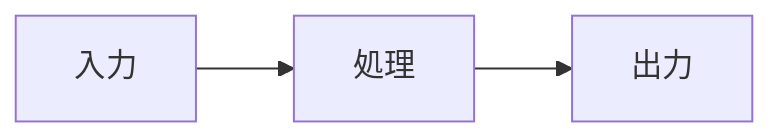

# 技術ブログ記事の書き方

このリポジトリは Astro の静的ブログ。記事は Markdown ファイルで、Astro がビルド時にページへ
変換する。既存記事の流儀に合わせ、ビルドが通る形で書くこと。

## 記事の置き場所

- `src/content/blog/` に Markdown ファイルを追加する。
- **ファイル名がそのまま URL スラッグになる**: `src/content/blog/my-post.md` → `/blog/my-post`。
- スラッグは短い英小文字＋ハイフン（例: `ff14-party-finder-kickoff.md`）。

## フロントマター（必須）

スキーマは `src/content.config.ts` で定義されている。全記事にこのブロックが必要:

```md
---
title: 記事のタイトル
description: 一覧・SEO・OGP に使われる1〜2文の概要
pubDate: 2026-07-04
author: taka
---
```

- `title`（文字列・必須）
- `description`（文字列・必須）— 一覧やメタタグに表示される
- `pubDate`（日付・必須）— `YYYY-MM-DD`
- `author`（文字列・任意）— `src/data/authors.ts` の **id**（例: `taka`）。省略時はデフォルト
  著者にフォールバックする。新しい著者を使うときは先に `src/data/authors.ts` に追加する。
  勝手な id を書かない。

## 図は Mermaid で描く（このブログの流儀）

最重要の規約。**既存記事はすべての図を Mermaid コードブロックで表現**しており、本文にラスタ
画像は無い。Mermaid はビルド時に SVG へ変換されるため、外部アセット不要で表示も速い。構成図・
フロー・シーケンス・構造図は Mermaid を優先する:

````md

````

コードのフェンス、表、短いインラインコードもよく使う。選択肢の比較には表を使うと分かりやすい。

## 画像（Mermaidでどうしても表現できない場合のみ）

スクリーンショット等でラスタ画像がどうしても必要なとき:

| ファイルの置き場所 | 参照の書き方 | 最適化 |
| :--- | :--- | :--- |
| `src/assets/` | `` | される（推奨） |
| `public/` | `/foo.png` | されない |

原則 `src/assets/` に置いて Astro に最適化させる。ただしまず「Mermaid で同じことを伝えられないか」
を検討する。たいてい Mermaid で足りるし、その方が流儀にも合う。

## 執筆の手順

1. `src/content/blog/<スラッグ>.md` を作り、上記フロントマターを書く。
2. 本文を Markdown で書く。既存記事の構成に合わせる: 短い導入 → `##` セクション → 要所に
   Mermaid 図や表 → 末尾に `## まとめ`。
3. 文体は既存記事（`deploy-pipeline.md`, `astro-blog-setup.md`）に合わせる: 説明的な日本語、
   具体的、図で見せる。
4. **ビルドで検証する**（検証ループ）:
   ```sh
   npm run build
   ```
   - ビルドがフロントマターをスキーマ検証し、Mermaid を SVG へ変換する。失敗したらエラーを
     読み、直して、通るまで再ビルドする。
   - 生成物に新しいルート（`/blog/<スラッグ>/index.html`）が出ているか確認する。

## Gotchas（つまずきポイント）

- **フロントマターはビルド時にスキーマ検証される。** 項目の欠落や型違い（例: `pubDate` が
  日付でない）でビルドが失敗する。`src/content.config.ts` に合わせること。
- **Mermaid → SVG 変換にはヘッドレスブラウザ（Playwright/Chromium）を使う。** ローカルは
  `npm install` 後にそのまま動くが、CI では `npm run build` の前に
  `npx playwright install --with-deps chromium` が必要。忘れるとビルドが落ちる。
- **`author` は `src/data/authors.ts` に存在する id であること。** 未知の id は黙ってデフォルト
  著者にフォールバックする。新規なら先に id を追加する。
- **Node のバージョンはこのリポの `.node-version` で固定**。グローバルの別バージョンに頼らない。
- 図に手書き HTML を使わない。Mermaid で書けば変換とスタイルが統一される。
