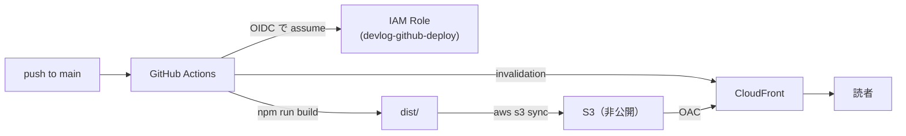

# infra — Devlog のデプロイ基盤（S3 + CloudFront）

このブログを **S3 + CloudFront** に配信するための Terraform 一式。
デプロイは GitHub Actions（`.github/workflows/deploy.yml`）が **OIDC** で AWS ロールを assume して行う。

## 構成



## 前提

- **会社とは別の個人 AWS アカウント**を使う（`default` プロファイル＝会社には触れない）。
- ルートアカウントには MFA を設定し、日常作業には使わない。
- Terraform 実行用に、個人アカウントで **IAM ユーザー（またはIAM Identity Center）** を作り、
  ローカルに名前付きプロファイルを設定しておく。

```sh
# 例：個人用プロファイルを作る（アクセスキーは個人IAMユーザーのもの）
aws configure --profile personal
# → Access Key / Secret / region(ap-northeast-1) を入力
```

`variables.tf` の `aws_profile`（既定 `personal`）がこのプロファイル名と一致していること。

## 手順

### 1. Terraform を適用

```sh
cd infra
terraform init
terraform plan       # 作られるリソースを確認
terraform apply
```

作成されるもの：S3 バケット（非公開）／CloudFront（OAC・HTTPS・index書き換えFunction）／
GitHub Actions 用 IAM OIDC プロバイダとデプロイロール。

### 2. 出力値を GitHub の Variables に登録

`terraform apply` 後、出力された値を GitHub リポジトリの
**Settings → Secrets and variables → Actions → Variables** に登録する（Secrets ではなく Variables でよい）。

| Variable 名 | 値（terraform output） |
| :--- | :--- |
| `AWS_DEPLOY_ROLE_ARN` | `github_deploy_role_arn` |
| `AWS_REGION` | `aws_region` |
| `S3_BUCKET` | `s3_bucket` |
| `CLOUDFRONT_DISTRIBUTION_ID` | `cloudfront_distribution_id` |

```sh
terraform output   # 4つの値を確認して登録する
```

### 3. デプロイ

`main` に push すると GitHub Actions が走り、ビルド → S3 同期 → CloudFront 無効化まで自動で行う。
公開URLは `terraform output cloudfront_url`（`https://xxxx.cloudfront.net`）。

## メモ

- **tfstate はローカル**に置いている（`*.tfstate` は `.gitignore` 済み。公開リポには絶対に出さない）。
  慣れたら `versions.tf` のコメントを外して **S3 + DynamoDB のリモートステート**へ移行する。
- **独自ドメイン**を付けるときは、ACM 証明書（`us-east-1`）＋ CloudFront の `aliases` ＋ Route 53 を追加する。
  そのための `us_east_1` プロバイダは `providers.tf` に用意済み。
- CloudFront の料金クラスは `PriceClass_200`（日本を含む）。低トラフィックなら費用はごくわずか。
