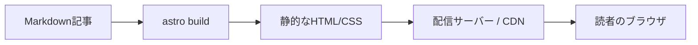
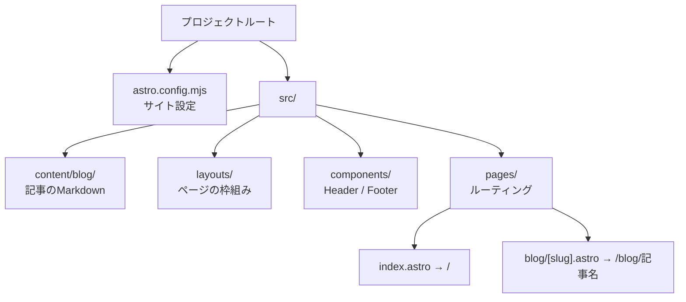
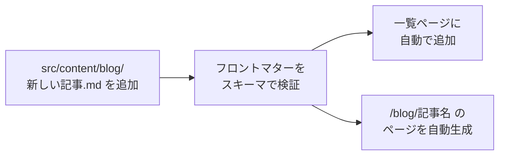
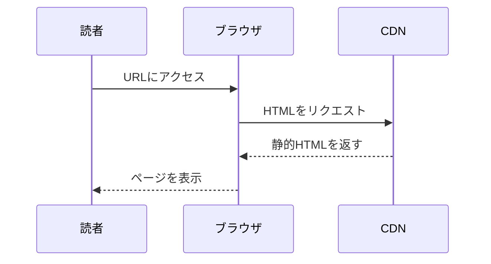
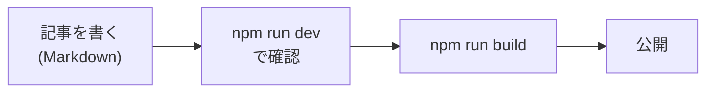

このブログは [Astro](https://astro.build/) という静的サイトジェネレーターで作られています。
この記事では、ローカルでの環境構築から記事の書き方までを、実際のコードと図を交えて解説します。

## Astroとは

Astroは、コンテンツ中心のWebサイトを高速に配信するためのフレームワークです。
ビルド時にHTMLを生成する「静的サイト生成」が得意で、技術ブログのような用途に向いています。

サイトが表示されるまでの流れは次のようになります。



あらかじめHTMLを作っておくため、読者がアクセスしたときの表示が速いのが特徴です。

## 環境構築

### 前提

Node.js が必要です。バージョンは `package.json` で指定しています。

```json
{
  "engines": {
    "node": ">=22.12.0"
  }
}
```

### セットアップ手順

リポジトリを取得してから、以下を実行します。

```sh
# 依存パッケージのインストール
npm install

# 開発サーバーの起動
npm run dev
```

起動すると `http://localhost:4321/` でローカルプレビューが見られます。
ファイルを保存すると自動でリロードされます。

主なコマンドは次のとおりです。

```sh
npm run dev      # 開発サーバー起動（localhost:4321）
npm run build    # 本番用に dist/ へ静的ビルド
npm run preview  # ビルド結果をローカルで確認
```

## ディレクトリ構成

プロジェクトの主要な構成は次のようになっています。



役割をまとめると次のとおりです。

| パス | 役割 |
| :--- | :--- |
| `src/content/blog/` | 記事のMarkdownファイルを置く場所 |
| `src/content.config.ts` | 記事の項目（タイトル等）のルールを定義 |
| `src/layouts/` | ページ共通の枠組み |
| `src/pages/` | URLに対応するページ |
| `astro.config.mjs` | サイト全体の設定 |

## 記事の書き方

記事は `src/content/blog/` に Markdown ファイルを追加するだけで増やせます。
ファイルの先頭には「フロントマター」と呼ばれるメタ情報を書きます。

```md
---
title: 記事のタイトル
description: 記事の概要（一覧やSEOで使われます）
pubDate: 2026-06-13
---

ここから本文をMarkdownで書きます。
```

このフロントマターの形式は `src/content.config.ts` で定義されており、
項目が欠けているとビルド時にエラーで気づけるようになっています。

```ts
import { defineCollection, z } from "astro:content";
import { glob } from "astro/loaders";

const blog = defineCollection({
  loader: glob({ pattern: "**/*.md", base: "./src/content/blog" }),
  schema: z.object({
    title: z.string(),
    description: z.string(),
    pubDate: z.date(),
  }),
});

export const collections = { blog };
```

ファイルを追加してから記事が公開されるまでの流れは次のとおりです。



新しいファイル名がそのまま記事のURLになります。
例えば `getting-started.md` を追加すると `/blog/getting-started` で公開されます。

## 画像を挿入する

画像は `src/assets/` に置き、Markdownから相対パスで参照します。

```md

```

`src/assets/` に置いた画像は、Astroがビルド時に**自動で最適化**（圧縮・サイズ変換）してくれます。
ロゴやアイコンなど最適化したくないファイルは `public/` に置き、`/sample.png` のように絶対パスで参照します。

| 置き場所 | 参照の書き方 | 最適化 |
| :--- | :--- | :--- |
| `src/assets/` | `../../assets/foo.png` | される（推奨） |
| `public/` | `/foo.png` | されない |

## Mermaidで図を描く

このブログでは [Mermaid](https://mermaid.js.org/) に対応しています。
` ```mermaid ` のコードブロックを書くと、**ビルド時に図（SVG）へ変換**されます。

例えば、次のように書くと——

````md

````

このように図として表示されます。


図はあらかじめSVGに変換されるため、読者のブラウザで追加のJavaScriptを動かす必要がなく、表示が速いのが利点です。

フローチャート、シーケンス図のほかにも、状態遷移図やクラス図などが描けます。
記事の内容に応じて使い分けると、文章だけより伝わりやすくなります。

## まとめ

このブログでの執筆の流れを振り返ると、次のようになります。



- 記事は `src/content/blog/` に Markdown を足すだけ
- 画像は `src/assets/` に置いて相対パスで参照
- 図は ` ```mermaid ` ブロックで描ける

これらを使って、図やコードを交えた分かりやすい技術記事を書いていきましょう。
