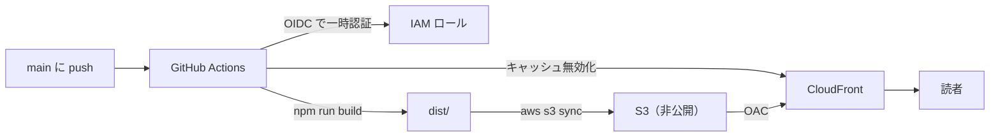
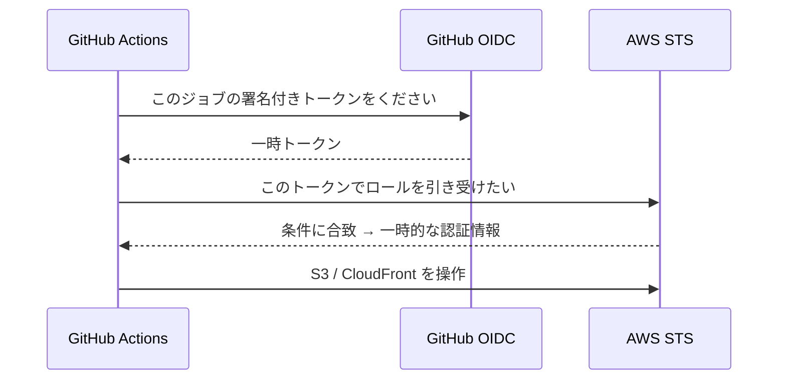

このブログは Astro で作った静的サイトです。ビルドすると `dist/` に HTML/CSS がそのまま吐き出されるだけなので、配信は「静的ファイルをどこかに置いて配る」だけで済みます。

そこで、**配信は S3 + CloudFront、インフラは Terraform で管理、デプロイは GitHub Actions**、という構成にしました。せっかくなので、アクセスキーを一切保存しない **OIDC** 方式で組んでいます。今回はその全体をまとめます。

## 全体の流れ

`main` に push すると、あとは全部自動で公開まで進みます。



人がやるのは「記事を書いて push する」だけ。ビルドもアップロードもキャッシュ更新も CI に任せます。

## 配信は S3 + CloudFront

静的サイトなので、凝ったサーバーは要りません。

- **S3**：ビルド成果物（`dist/` の中身）の置き場所。**バケットは非公開**にして、直接は公開しない
- **CloudFront**：S3 の前に置く CDN。HTTPS 化と高速配信を担当。S3 へは **OAC（Origin Access Control）** 経由でのみアクセスさせる

「S3 を公開せず、CloudFront 経由だけ許可する」のがポイントです。バケットのパブリックアクセスは全部ブロックして、CloudFront からの読み取りだけをバケットポリシーで許可しています。

## インフラは Terraform で組む

この S3 や CloudFront、あとで出てくる IAM ロールなどを、手でポチポチ作るのではなく **Terraform** でコード化しました。いわゆる IaC（Infrastructure as Code）です。

コードにしておくと、「何をどう作ったか」が全部ファイルに残るし、`terraform plan` で変更前に差分を確認できるし、消したいときも `terraform destroy` で一発です。手作業だと「あれ、この設定どこで変えたっけ」がすぐ発生するので、最初からコードにしておくと安心でした。

`infra/` に置いた Terraform が作るのは、だいたいこのあたりです。

- S3 バケット（非公開）＋ パブリックアクセスブロック ＋ バケットポリシー
- CloudFront ディストリビューション ＋ OAC
- ディレクトリ URL を `index.html` に書き換える CloudFront Function
- GitHub Actions 用の IAM OIDC プロバイダ ＋ デプロイ用ロール

例えば S3 は、こんな感じで非公開に倒しています。

```hcl
resource "aws_s3_bucket_public_access_block" "site" {
  bucket                  = aws_s3_bucket.site.id
  block_public_acls       = true
  block_public_policy     = true
  ignore_public_acls      = true
  restrict_public_buckets = true
}
```

適用は `terraform apply`。作られた S3 バケット名や CloudFront の ID は `output` で受け取れるようにしておいて、後で GitHub 側に渡します。

> `terraform.tfstate`（現在の状態を記録するファイル）には情報が詰まっているので、**リポジトリには絶対にコミットしない**ように `.gitignore` に入れています。このリポは公開なので特に注意しました。

## GitHub Actions で自動デプロイ

`main` への push で走るワークフローはこんな流れです。

```yaml
on:
  push:
    branches: [main]

permissions:
  id-token: write   # OIDC に必要
  contents: read

jobs:
  deploy:
    runs-on: ubuntu-latest
    steps:
      - uses: actions/checkout@v4
      - uses: actions/setup-node@v4
        with:
          node-version-file: .node-version
      - run: npm ci
      # Mermaid の SVG 化に Chromium が要る
      - run: npx playwright install --with-deps chromium
      - run: npm run build
      - uses: aws-actions/configure-aws-credentials@v4
        with:
          role-to-assume: ${{ vars.AWS_DEPLOY_ROLE_ARN }}
          aws-region: ${{ vars.AWS_REGION }}
      - run: aws s3 sync ./dist "s3://${{ vars.S3_BUCKET }}" --delete
      - run: aws cloudfront create-invalidation --distribution-id "${{ vars.CLOUDFRONT_DISTRIBUTION_ID }}" --paths "/*"
```

やっていることは、ビルド → AWS に認証 → S3 に同期 → CloudFront のキャッシュを消す、の4つ。ロールの ARN やバケット名は秘密ではないので、GitHub の **Variables** に入れて参照しています。

最後の **キャッシュ無効化**は忘れがちですが大事で、これをやらないと CloudFront が古いファイルを配り続けて、記事を更新しても反映されません。

## アクセスキーを保存しない（OIDC）

一番こだわったのがここです。GitHub Actions から AWS を触るとき、昔ながらのやり方だと **IAM ユーザーのアクセスキーを GitHub の Secrets に保存**します。でもこれは、キーが漏れたら終わり、というリスクを常に抱えることになります。

代わりに **OIDC** を使うと、キーを保存せずに済みます。



AWS 側には「GitHub の、**この特定のリポジトリの main ブランチ**からのリクエストだけ、このロールを引き受けてよい」という信頼条件を設定しておきます。だから、たとえトークンの仕組みを知られても、別のリポジトリからは使えません。保存された秘密が存在しないので、漏れるものがそもそも無い、という状態にできます。

ロール側の権限も、デプロイに必要な最小限（対象バケットへの同期と、対象ディストリビューションの無効化だけ）に絞っています。

## ちょっとした工夫

静的サイトを CloudFront + S3（OAC）で配ると、`/blog/xxx/` のような**ディレクトリ形式の URL がそのままだと 404 になる**という罠があります。実体は `/blog/xxx/index.html` だからです。

これは **CloudFront Function**（配信の手前で動く軽量スクリプト）で、URL を書き換えて解決しました。

```js
function handler(event) {
  var request = event.request;
  var uri = request.uri;
  if (uri.endsWith("/")) {
    request.uri += "index.html";
  } else if (!uri.includes(".")) {
    request.uri += "/index.html";
  }
  return request;
}
```

あわせて、存在しない URL は Astro の 404 ページを返すように、CloudFront のエラーレスポンスも設定しています。

## まとめ

- 配信は **S3 + CloudFront**（S3 は非公開、CloudFront から OAC 経由でのみ配る）
- インフラは **Terraform** でコード化。tfstate は公開リポに出さない
- デプロイは **GitHub Actions**。push → build → S3 同期 → キャッシュ無効化
- 認証は **OIDC**。アクセスキーを保存せず、対象リポの main だけにロールを許可

これで「記事を書いて push すれば公開される」状態になりました。次に手を入れるなら、独自ドメイン（ACM + Route 53）と、tfstate のリモート化あたりだと思っています。
