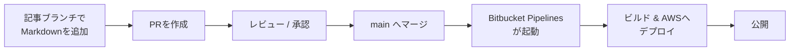
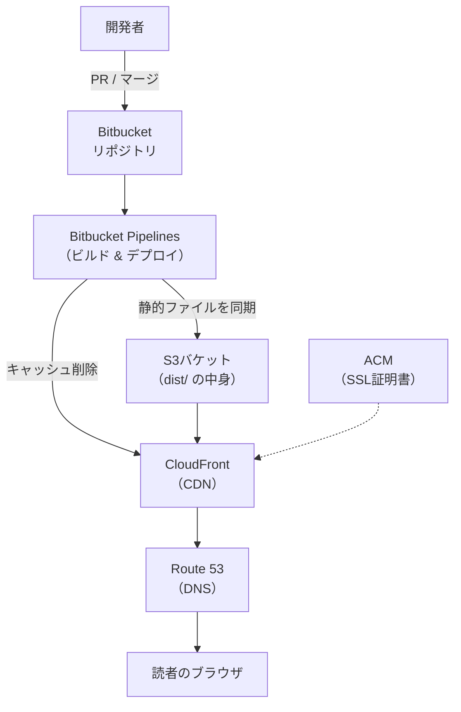
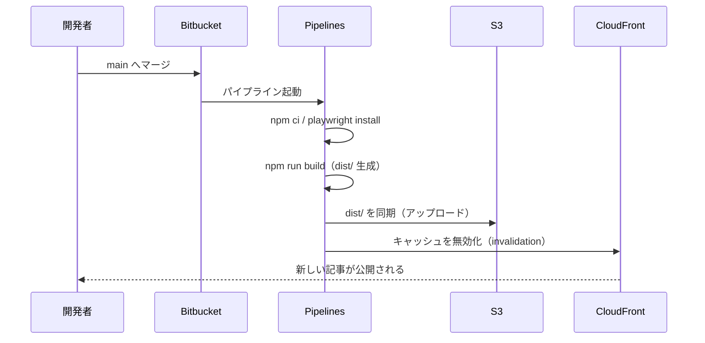
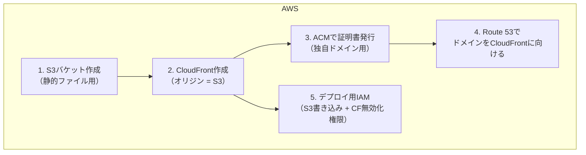
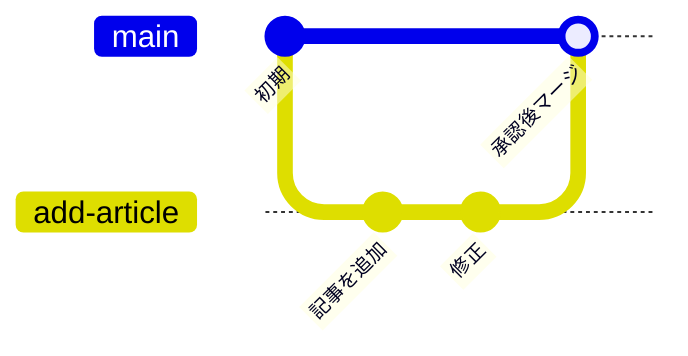
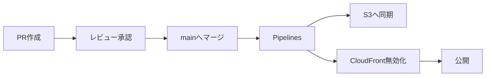

> この記事は、このブログを将来的にどう運用していくかの**構想をまとめたもの**です。
> ここに書かれた設定や環境構築はまだ実施しておらず、これから整備していく予定です。

## 実現したい運用フロー

記事の追加から公開までを、次のような流れで回せるようにしたいと考えています。

1. 記事用のブランチを切り、Markdownを追加する
2. プルリクエスト（PR）を作成する
3. レビューで承認を得る
4. `main` ブランチへマージする
5. マージをトリガーに Bitbucket Pipelines が動き、AWSへ自動デプロイされる



人手による作業は「記事を書く」「レビューする」だけで、ビルドとデプロイは自動化するのが狙いです。

## AWSの構成

静的サイトなので、**S3 + CloudFront** を中心としたシンプルな構成を想定しています。



各要素の役割は次のとおりです。

| サービス | 役割 |
| :--- | :--- |
| **S3** | ビルド成果物（`dist/` の静的ファイル）の保管場所 |
| **CloudFront** | S3の前段に置くCDN。配信の高速化とHTTPS化 |
| **ACM** | CloudFront用のSSL証明書（HTTPS化に必須） |
| **Route 53** | ドメインのDNS。`example.com` 等をCloudFrontに向ける |
| **Bitbucket Pipelines** | ビルドとデプロイを実行するCI/CD |

CloudFrontを挟むことで、世界中どこからでも速く、かつHTTPSで配信できます。
S3を直接公開せず、CloudFront経由のみアクセスを許可するのが一般的な構成です。

## デプロイの流れ（マージ後）

`main` にマージされてから公開されるまでを、もう少し細かく見ると次のようになります。



ポイントは最後の **CloudFrontのキャッシュ無効化** です。
CloudFrontは配信を速くするためにファイルをキャッシュするので、
S3を更新しただけでは古い内容が表示され続けます。
デプロイの最後にキャッシュを消す（invalidation）ことで、最新の記事がすぐ反映されます。

## 必要な設定（これから整備する項目）

実現にあたって用意が必要なものを、AWS側・Bitbucket側に分けて整理します。

### AWS側



- **S3バケット**: ビルド成果物の置き場所
- **CloudFront**: S3をオリジンに設定。デフォルトルートを `index.html` に
- **ACM**: 独自ドメインでHTTPS配信するための証明書（CloudFront用は**バージニア北部 `us-east-1`** で発行する点に注意）
- **Route 53**: ドメインのDNSレコードをCloudFrontに向ける
- **IAMユーザー（またはOIDC）**: Pipelinesがデプロイに使う認証情報。権限は「S3への書き込み」と「CloudFrontのinvalidation」に絞る

### Bitbucket側

Pipelinesで使う認証情報は、リポジトリの **Repository variables** に登録します
（コードには書かず、秘密情報として管理する）。

| 変数名 | 用途 |
| :--- | :--- |
| `AWS_ACCESS_KEY_ID` | デプロイ用IAMのアクセスキー |
| `AWS_SECRET_ACCESS_KEY` | 同シークレットキー（Secured指定） |
| `AWS_DEFAULT_REGION` | リージョン |
| `S3_BUCKET` | デプロイ先バケット名 |
| `CLOUDFRONT_DISTRIBUTION_ID` | キャッシュ無効化の対象 |

そのうえで、リポジトリ直下に `bitbucket-pipelines.yml` を置きます。
イメージとしては次のような内容になります。

```yaml
image: node:22

pipelines:
  # main へのマージ・push で本番デプロイ
  branches:
    main:
      - step:
          name: Build & Deploy
          deployment: production
          caches:
            - node
          script:
            - npm ci
            # Mermaidの図をSVG化するために必要
            - npx playwright install --with-deps chromium
            - npm run build
            # dist/ を S3 へ同期
            - pipe: atlassian/aws-s3-deploy:1.6.0
              variables:
                AWS_ACCESS_KEY_ID: $AWS_ACCESS_KEY_ID
                AWS_SECRET_ACCESS_KEY: $AWS_SECRET_ACCESS_KEY
                AWS_DEFAULT_REGION: $AWS_DEFAULT_REGION
                S3_BUCKET: $S3_BUCKET
                LOCAL_PATH: dist
                DELETE_FLAG: "true"
            # CloudFront のキャッシュを無効化
            - pipe: atlassian/aws-cloudfront-invalidate:0.6.0
              variables:
                AWS_ACCESS_KEY_ID: $AWS_ACCESS_KEY_ID
                AWS_SECRET_ACCESS_KEY: $AWS_SECRET_ACCESS_KEY
                AWS_DEFAULT_REGION: $AWS_DEFAULT_REGION
                DISTRIBUTION_ID: $CLOUDFRONT_DISTRIBUTION_ID

  # PR作成時はビルドが通るかだけ確認（デプロイはしない）
  pull-requests:
    "**":
      - step:
          name: Build check
          caches:
            - node
          script:
            - npm ci
            - npx playwright install --with-deps chromium
            - npm run build
```

`pull-requests` 側でビルドチェックだけ走らせておくと、
**マージ前に壊れた記事を検知**できるので安心です。

## ブランチ運用とレビュー

`main` を保護ブランチにして、直接pushを禁止し、必ずPR経由にします。



- `main` への直接pushは禁止（保護ブランチ）
- 記事ごとにブランチを切ってPRを作成
- レビュー承認 + PRビルドの成功をマージ条件にする

これにより「レビューを通っていない記事が勝手に公開される」事故を防げます。

## 運用時の注意点

実際に運用する際に気をつけたい点をまとめておきます。

- **Playwrightのインストール**: このブログはMermaidをビルド時にSVG化するため、CI上でも `npx playwright install --with-deps chromium` が必要です。これを忘れるとビルドが失敗します。
- **CloudFrontのキャッシュ無効化**: invalidationには無料枠があり、それを超えると課金対象です。毎デプロイで `/*`（全体）を無効化すると枠を消費しやすいので、頻度や対象範囲は様子を見て調整します。
- **`site` の設定**: `astro.config.mjs` の `site` を本番ドメインに合わせること。これがRSS・sitemap・OGPのURLに反映されます。
- **認証情報の管理**: AWSのキーはコードに含めず、必ずBitbucketのSecured変数で管理します。権限も必要最小限（S3書き込み + CF無効化）に絞ります。

## まとめ



目指す姿は「**記事を書いてPRを出すだけで、承認・マージをきっかけに自動で公開される**」状態です。

- 配信基盤は S3 + CloudFront を中心としたシンプルな構成
- デプロイは Bitbucket Pipelines に集約し、ビルドからキャッシュ無効化まで自動化
- `main` は保護し、レビューを通った記事だけが公開される

繰り返しになりますが、これは**今後整備していくための構想**です。
実際の構築は、この記事の内容をベースに順次進めていく予定です。
