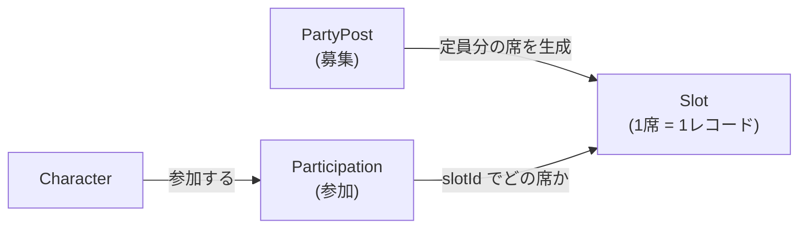
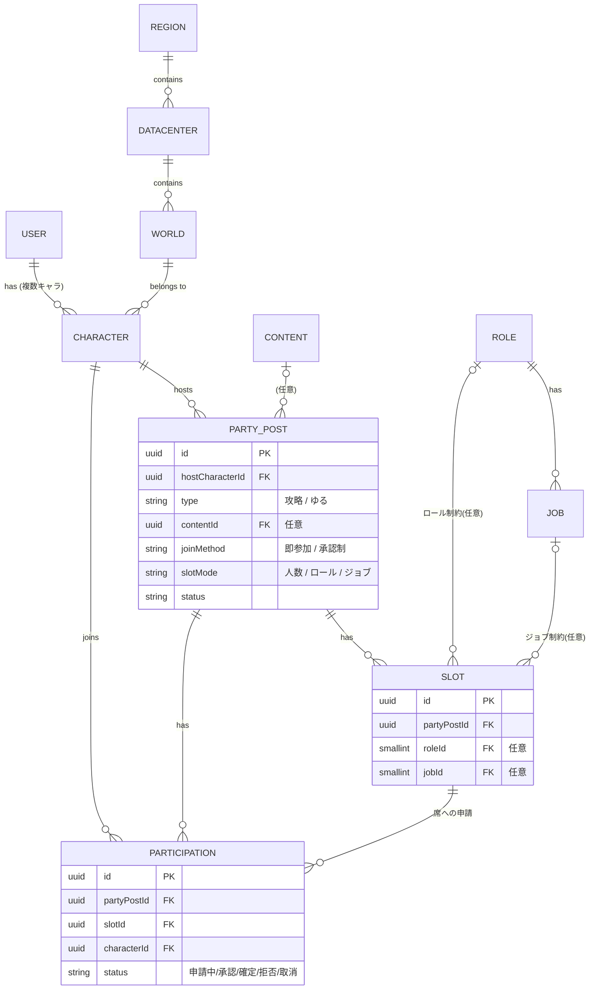

連載4回目です。前回で要件定義とざっくりした ER 図まで作ったので、「じゃあ Phase 1 でコードを書くぞ」と意気込んでいました。……が、いざその ER 図をそのままテーブルに落とそうとしたら、粗があちこち見えてきました。

というわけで今回は、手を動かす直前に**データモデルを実装に耐える形まで作り込んだ**話です。コードはまだ書きません。地味ですが、ここを詰めておくと後がだいぶ楽になるはず、という賭けです。

## いざ実装しようとしたら、ER 図が粗かった

前回の ER 図は「登場人物の関係」を描いただけで、実際にテーブルにするには決めていないことが多すぎました。たとえば：

- サーバーの階層（リージョン > データセンター > ワールド）を、文字列で持つのかテーブルにするのか
- ロールやジョブを、ただの文字列にするのか、マスタにするのか
- ID は何型にするのか、enum はどう持つのか、削除はどうするのか
- そもそも「募集の枠（Slot）」って、どういうレコードとして持つのが正解なんだ？

このあたりを曖昧にしたまま実装に入ると、途中で必ず手戻りします。なので一つずつ潰していきました。

## サーバーの階層は、ちゃんとテーブルにする

最初に引っかかったのがサーバーの階層です。前回は DataCenter と World しか描いていなくて、リージョン（日本 / 北米 / 欧州…）は DataCenter の文字列カラムで持たせるつもりでした。

でも、DataCenter と World をテーブルにしているのに、リージョンだけ文字列というのは一貫性がありません。しかも FF14 では**データセンタートラベルが同じリージョン内に限定される**という仕様があって、リージョンはドメイン上ちゃんと意味を持つ存在です。将来リージョンで絞り込んだり、タイムゾーンを扱ったりするときにも効いてきます。

なので、Region も独立したマスタテーブルにして、素直に3段の階層にしました。

「あとで文字列から FK に直す」のはマイグレーションが地味に面倒なので、最初から正しい形にしておく方が結局安上がり、という判断です。

## ロールとジョブもマスタにする

ロール（Tank / Healer / DPS）とジョブ（ナイト / 白魔道士…）も、最初は定数でいいかと思っていました。ただ、募集の枠や参加でこれらを参照するし、拡張パッチでジョブが増えることを考えると、マスタテーブルにして seed で管理する方が素直です。ジョブは1つのロールに属すので、そこも関係として持たせました。

## 全テーブルの「決めごと」を先に固める

個別のテーブルを詰める前に、全部に共通する方針を先に決めました。都度バラバラに決めると、絶対に不整合が出るからです。

| 決めごと | どうしたか |
| :--- | :--- |
| 主キー | 募集や参加などは **UUIDv7**、マスタは小さな固定 ID |
| enum 的な値 | DB は文字列。値の定義とバリデーションは共有パッケージの zod に集約 |
| 削除 | 物理削除。「キャンセル」など状態として残したいものは status で表現 |
| 命名 | DB は snake_case、コードは camelCase |

UUIDv7 にしたのは、URL に連番を出したくない（`/posts/1`, `/posts/2` と辿られると総数が読めてしまう）一方で、ただのランダム UUID だと並び順が扱いにくいからです。UUIDv7 は生成時刻順に並ぶので、そのあたりがちょうどいい。

enum を DB の ENUM 型にしなかったのは、値を追加するたびに ALTER が要るのと、どうせフロントとバックで同じ選択肢を使うので、**共有パッケージの zod を単一の真実**にしたかったからです。

## いちばん考えた「募集の枠」の持ち方

今回いちばん手が止まったのがここです。募集の「枠（Slot）」は、募集ごとに3つのモードを取ります。

- **人数モード**：定員だけ（例：4人）
- **ロールモード**：Tank / Healer / DPS の枠（例：T1 H1 D2）
- **ジョブモード**：ジョブ指定の枠（例：ナイト1・白魔1…）

この3つをどう1つの形に落とすかで、ずいぶん悩みました。最初は「枠の種類ごとに1行持って、定員（capacity）を持たせる」案（人数4なら1行で capacity=4、T1H1D2 なら3行）を考えたんですが、これだとモードによって「1行の意味」が変わってしまって、埋まり数の集計や重複チェックがモード依存でややこしくなる。

そこで発想を変えて、**1 Slot = 1席**にしました。募集を作るときに、定員の数だけ「席」を作る。席にはロールやジョブの制約を任意で付ける。それだけ。

| モード | 例 | 作られる Slot（席） |
| :--- | :--- | :--- |
| 人数 | 4人 | 制約なしの席 ×4 |
| ロール | T1 H1 D2 | Tank席・Healer席・DPS席・DPS席 |
| ジョブ | PLD/WHM/DRG/BLM | ナイト席・白魔席・竜騎士席・黒魔席 |

こうすると3モードが全部「席のリスト（制約は任意）」という**1つの形**に揃います。定員は席の数、埋まりは確定済みの席の数、重複チェックは「その席が空いてるか」だけ。参加（Participation）は、その席を1つ取るだけになります。

FF14 のパーティは最大でも8人と小さいので、「席の数だけ行が増える」という欠点は実質ありません。それより、全モードが同じ構造になるシンプルさの方がずっと価値がある、と判断しました。

## 出来上がった ER 図

作り込んだ結果がこれです。前回よりだいぶ登場人物が増えました。

コンテンツ（何に挑む募集か）まわりはまだ「Content 1つ」でざっくりですが、ここは検索のカギになる部分なので、次回じっくり設計します。

## まとめ

- ざっくり ER 図は、実装しようとすると必ず粗が見える。手を動かす前に作り込む価値がある
- サーバー階層は Region までちゃんとマスタにして3段の階層に
- ID・enum・削除といった全テーブル共通の方針は、先にまとめて決めておく
- 募集の枠は「1席 = 1レコード」の席ベースにして、3モードを1つの形に統一した

次回は、このアプリの本丸である「募集を探しやすくする」＝検索の設計です。コンテンツの絞り込みや、募集の雰囲気での絞り込みをどうモデルに落とすかを書きます。
