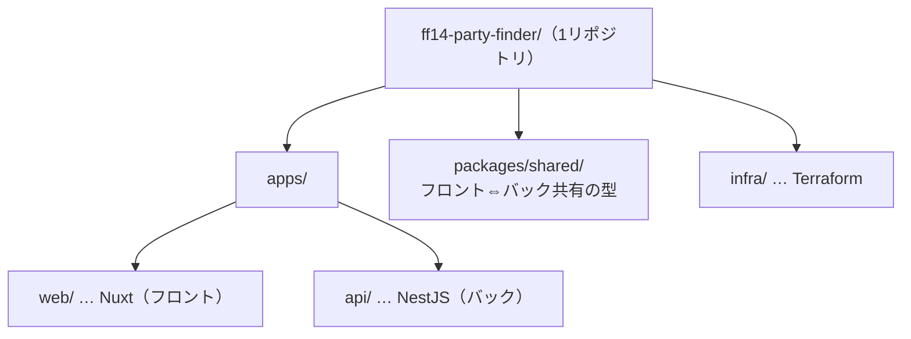
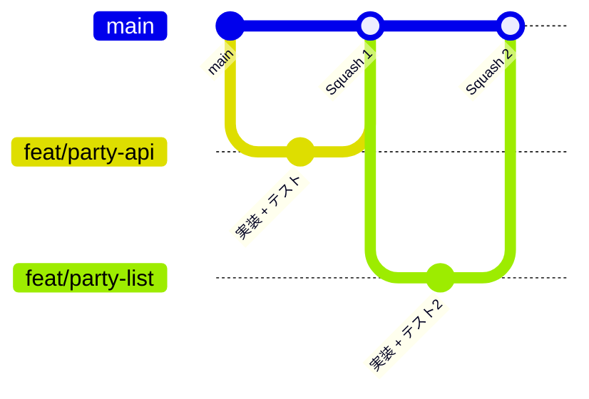
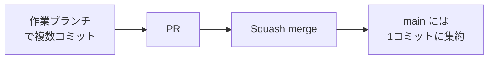
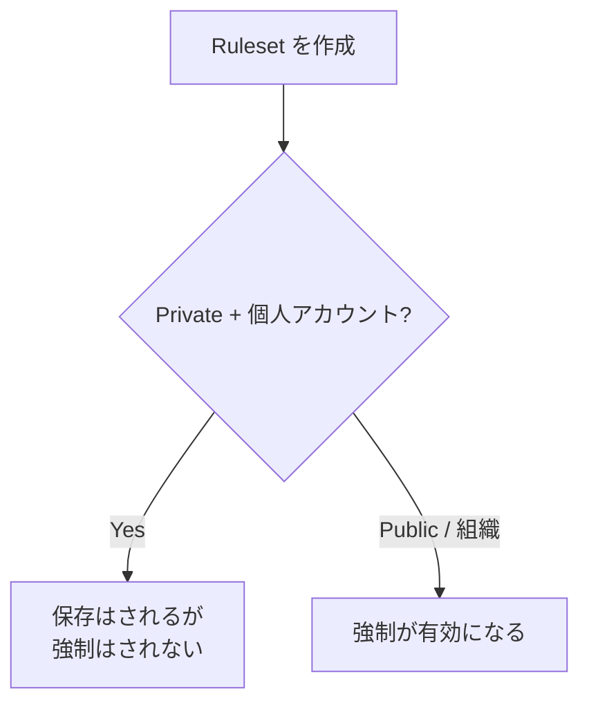

FF14 パーティー募集アプリ開発の連載、第2回です。今回はコードを書き始める前の土台として、**GitHub まわりの運用**を固めます。リポジトリの分け方、ブランチ戦略、`main` の保護まで、「なぜそうするか」を添えて整理します。

個人開発ですが、**実務に近い規律**を意図的に取り入れます。これも学習の一部です。

## リポジトリ戦略：モノレポを選ぶ

フロントエンド・バックエンド・インフラを、**1つのリポジトリ（モノレポ）**にまとめます。



分け方には「モノレポ」と「マルチレポ（リポを分割）」がありますが、今回の条件——**ソロ開発・TypeScript フルスタック・型共有あり**——ではモノレポが有利です。

| 観点 | モノレポ | マルチレポ |
| :--- | :--- | :--- |
| 型の共有 | `packages/shared` で一元管理できる | リポ跨ぎは公開や submodule が必要で摩擦大 |
| 横断変更 | API とフロントを1つの変更として扱える | 複数リポで協調が必要 |
| ローカル開発 | clone・install が1回 | 複数回、バージョンずれも起きやすい |

重要なのは、**「モノレポ＝密結合」ではない**こと。1リポの中で `apps/web` と `apps/api` のパッケージ境界を切り、別々の Docker イメージとしてデプロイします。**実行の分離は保ったまま**、コード管理だけを1か所にまとめる、という考え方です。

## ブランチ戦略：GitHub Flow

ステージング等の常設環境は持たない方針なので、**GitHub Flow** という軽量な戦略が合います。`main` から作業ブランチを切り、PR を経てマージする、シンプルな流れです。



ルールはこうです。

- `main` は常にデプロイ可能な状態に保つ（**保護ブランチ**）
- `main` への直接 push は禁止。変更は必ず**作業ブランチ → PR** を経由する
- 作業ブランチは `main` から作成し、**短命**に保つ（目的を1つに絞る）

ブランチ名は `type/短い説明` の形で、後述のコミット規約と揃えます（例: `feat/party-crud-api`、`fix/login-redirect`、`docs/blog-phase0`）。

## コミットとマージ：Conventional Commits ＋ Squash

コミットメッセージは **Conventional Commits** に従います。`type(scope): 概要` の形で、履歴から「何をしたか」が一目で分かります。

```
feat(api): 募集作成APIを追加
fix(web): ログイン後のリダイレクト先を修正
```

マージは **Squash and merge** を既定にし、**1 PR = 1 コミット**とします。



「複数コミットが意味を持つなら残すべきでは？」という論点もありますが、これは**履歴の単位をコミットにするか PR にするか**の判断です。今回はソロ開発で、1つの PR に実装とテストがまとまり、細かくコミットを分ける必要が薄いため、**PR を履歴の単位にする Squash** が素直です。`main` の履歴が「1 PR = 1つの意味ある変更」で線形に並び、追いやすくなります。

> チームで各コミットが atomic に作り込まれる場合は、Merge commit で個別コミットを残す方が良い場面もあります。方式は目的次第で、絶対の正解が1つあるわけではありません。

## main の保護：Ruleset

`main` を守るため、GitHub の **Ruleset** を設定しました。チェックした項目と意味は次のとおりです。

| 項目 | 意味 |
| :--- | :--- |
| **Require a pull request before merging** | `main` へは必ず PR 経由。直 push を禁止。**Required approvals = 0**（ソロなので承認者0＝自分の PR を自分でマージできる） |
| **Require linear history** | マージコミットを許さず、直線的な履歴を強制する。Squash 運用と一致し、履歴が追いやすい |
| **Block force pushes** | `git push -f` による履歴の上書きを禁止する。履歴の破壊・改ざんを防ぐ |
| **Restrict deletions** | `main` ブランチ自体の削除を禁止する。誤操作や事故を防ぐ |

`main` への直 push を止め、PR とセルフレビューを必ず通す——という運用を、プラットフォーム側でも担保する狙いです。CI（lint / test）が整ったら、その通過も必須チェックに追加します。

### 無料プランでの制約

ここで1つ注意点があります。**個人アカウントの Private リポジトリでは、Ruleset は保存できても「強制」されません**（強制には組織の Team プラン等が必要）。



ではどうするか。ソロ開発では、**プラットフォームの強制がなくても運用は成立**します。実際にやること（直 push しない・PR 経由・セルフレビュー・Squash）は同じで、**自己規律**で回します。Ruleset は「作って保存」しておけば、将来 Public にしたり組織へ移した時点で自動的に効き始めます。将来のための備え、と位置づけました。

なお、ローカルでの自衛策として、`main` への直 push を Git フックで警告・中断する仕組み（lefthook 等）を後のフェーズで足す予定です。

## まとめ

コードを書く前の GitHub まわりの土台が固まりました。

- **リポジトリ**: モノレポ（型共有・横断変更・ソロでの手軽さが理由）。実行の分離は保つ
- **ブランチ**: GitHub Flow。`main` から作業ブランチ → PR → マージ
- **コミット/マージ**: Conventional Commits ＋ Squash（1 PR = 1 コミット）
- **main の保護**: Ruleset（PR 必須・線形履歴・force push 禁止・削除禁止）。無料 Private では強制されないため、当面は自己規律で運用

次回からは、いよいよ設計（要件定義・ドメインモデリング）に入っていきます。
