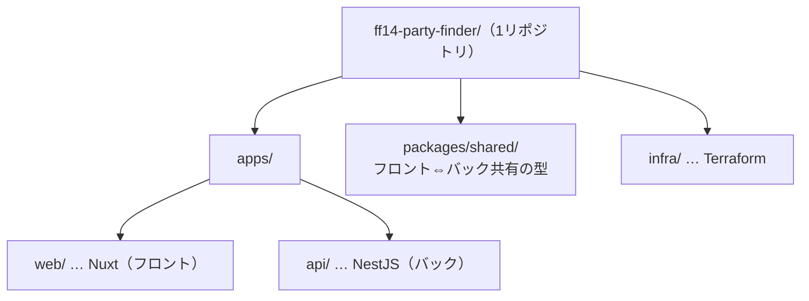
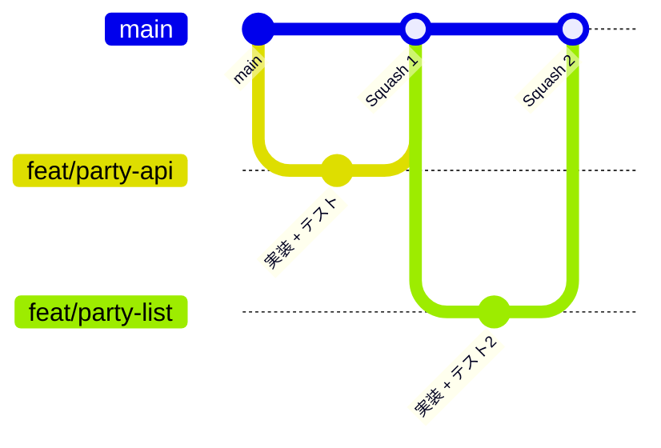
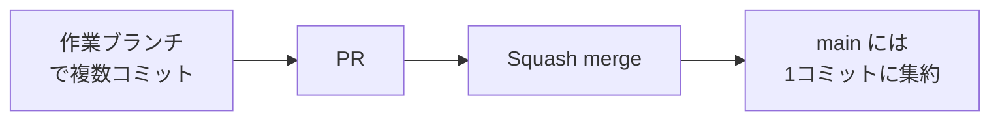
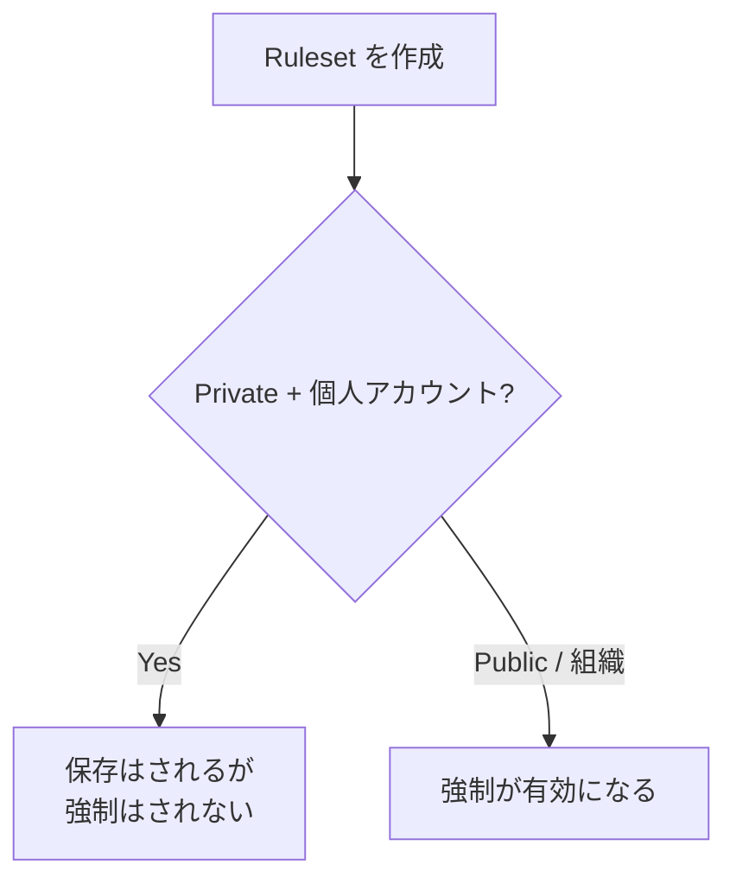

連載2回目です。今回はコードを書き始める前の下ごしらえとして、GitHub まわりの運用を決めます。リポジトリをどう分けるか、ブランチをどう切るか、`main` をどう守るか。それぞれ「なぜそうするのか」まで含めて整理しておきます。

個人開発なので雑にやろうと思えばいくらでも雑にできるんですが、あえて実務に近い規律を入れます。これも練習のうち、という気持ちです。

## リポジトリはモノレポにする

フロント・バック・インフラを、1つのリポジトリにまとめることにしました。



分け方には、1リポにまとめる「モノレポ」と、リポを分ける「マルチレポ」があります。今回はソロ開発で、TypeScript のフルスタック、しかもフロントとバックで型を共有したい。この条件だとモノレポがかなり有利でした。

| 観点 | モノレポ | マルチレポ |
| :--- | :--- | :--- |
| 型の共有 | `packages/shared` で一元管理できる | リポ跨ぎだと公開や submodule が必要で面倒 |
| 横断的な変更 | API とフロントを1回の変更で扱える | 複数リポで足並みを揃える必要がある |
| ローカル開発 | clone も install も1回で済む | 何度もやることになる。バージョンずれも起きやすい |

一つ勘違いしやすいのが、モノレポ＝密結合、ではないところです。1つのリポの中でも `apps/web` と `apps/api` はパッケージとして境界を切りますし、デプロイも別々の Docker イメージに分けます。動かす単位はちゃんと分離したまま、コードの置き場所だけ1か所にまとめる、というイメージです。

## ブランチ運用は GitHub Flow

ステージングのような常設の環境は今回持たないので、シンプルな GitHub Flow が合っていました。`main` から作業ブランチを切って、PR を通してマージする。それだけです。



自分に課すルールはこのくらい。

- `main` は常にデプロイできる状態に保つ（保護ブランチ）
- `main` への直接 push はしない。変更は必ず作業ブランチ → PR を通す
- 作業ブランチは `main` から切って、目的を1つに絞って短命に保つ

ブランチ名は `type/短い説明` で、後述のコミット規約と揃えています（`feat/party-crud-api`、`fix/login-redirect` など）。

## コミットとマージ：Conventional Commits ＋ Squash

コミットメッセージは Conventional Commits に従います。`type(scope): 概要` の形にしておくと、履歴を眺めるだけで「何をしたか」が分かって気持ちいいです。

```
feat(api): 募集作成APIを追加
fix(web): ログイン後のリダイレクト先を修正
```

マージは Squash and merge を基本にして、1 PR = 1 コミットにします。



これには「PR の中の複数コミットが意味を持つなら、残した方がいいんじゃない？」という反論もあります。実際そのとおりで、要は履歴の単位をコミットにするか PR にするかの好みの問題です。今回はソロで、1つの PR に実装とテストがまとまるし、コミットを細かく分ける必然性も薄い。だったら PR を履歴の単位にする Squash が素直でした。`main` の履歴が「1 PR = 1つのまとまった変更」で一直線に並んで、後から追いやすくなります。

チームで、各コミットが丁寧に作り込まれているような現場だと、Merge commit で1つ1つ残す方が良い場面もあると思います。ここは正解が1つに決まる話ではなさそうです。

## main を守る：Ruleset

`main` を守るために、GitHub の Ruleset を設定しました。入れた項目はこのあたりです。

| 項目 | 何をするか |
| :--- | :--- |
| Require a pull request before merging | `main` へは必ず PR 経由。直 push を禁止する（Required approvals = 0 にしておけば、ソロでも自分の PR を自分でマージできる） |
| Require linear history | マージコミットを許さず、履歴を一直線に保つ。Squash 運用と相性がいい |
| Block force pushes | `git push -f` での履歴の上書きを禁止。事故や改ざんを防ぐ |
| Restrict deletions | `main` ブランチそのものの削除を禁止 |

要は「直 push は禁止、必ず PR とセルフレビューを通す」という運用を、自分の意志だけでなく仕組みでも縛りたかった、ということです。CI（lint / test）が整ったら、その通過も必須条件に足すつもりです。

### ……と思ったら、無料プランでは効かなかった

ここで一つ落とし穴がありました。個人アカウントの Private リポジトリだと、Ruleset は作れても実際には強制されないんです（強制するには組織の Team プランなどが必要）。設定画面にもその旨の注意書きが出ていました。



じゃあ意味がないかというと、そうでもありません。ソロ開発なら、仕組みで縛られていなくても運用自体は成り立ちます。やることは同じ（直 push しない、PR を通す、セルフレビューする、Squash でマージする）で、あとは自分で守るだけ。Ruleset も作るだけ作っておけば、将来 Public にしたり組織に移した時点で自動的に効き始めます。今は「将来のための予約」くらいの位置づけです。

ローカルでの自衛策として、`main` への直 push を Git フックで止める仕組み（lefthook など）は、後のフェーズで入れる予定です。

## まとめ

コードを書く前の、GitHub まわりの土台が固まりました。

- リポジトリはモノレポ（型の共有・横断変更・ソロでの手軽さが理由）。動かす単位は分ける
- ブランチは GitHub Flow。`main` から作業ブランチを切って PR でマージ
- コミットは Conventional Commits、マージは Squash（1 PR = 1 コミット）
- `main` は Ruleset で保護。無料 Private では強制されないので、当面は自己規律で運用

次回はいよいよ設計、要件定義とドメインモデリングの話です。
