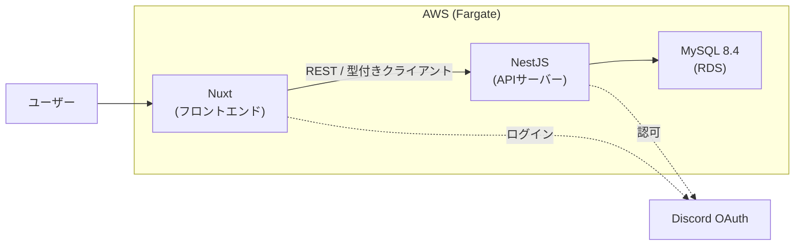
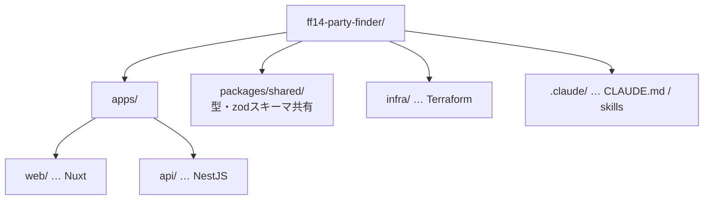
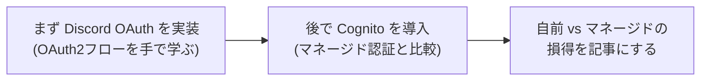
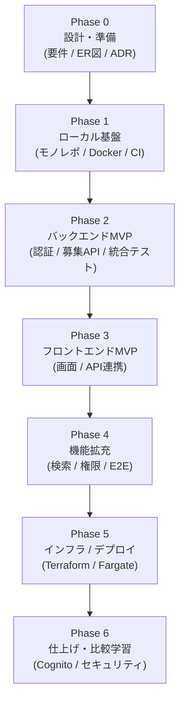

個人開発の題材として、**FF14（ファイナルファンタジーXIV）のパーティー募集アプリ**を作り始めます。
ただし一番の目的は「アプリを早く完成させること」ではなく、**開発を通じて自分のスキルを高めること**です。
そのため、あえてモダンでベストプラクティスな構成を選び、フロント/バック分離・コンテナ・クラウドデプロイまで一通り実践します。

この連載では、その過程を少しずつ記事にしていきます。第1回の今回は、**技術選定の記録**です。

## 何を作るのか

FF14には、一緒にコンテンツへ挑む仲間を探す「パーティ募集」という文化があります。それをWebアプリにします。まずはMVPとして「募集の作成・一覧・詳細・参加」に絞り、そこから育てていきます。

ドメインとして意識するのは次のあたりです。

- **サーバー階層**: リージョン > データセンター(DC) > ワールド。DCをまたいだ募集も考慮
- **コンテンツ種別**: 零式 / 絶 / エキルレ / 討滅戦 / ダンジョン など
- **ロール構成**: Tank / Healer / DPS の枠と、ジョブ単位の空き管理
- **募集の状態**: 募集中 / 満員 / 締切 / 開催済み、開始時刻・タイムゾーン

## 選定の方針

「学ぶこと」が目的なので、選定の軸は次の3つに置きました。

1. **モダンでベストプラクティスな構成**であること
2. なるべく**新しいメジャーバージョン**を使うこと
3. 業務で触れている **Vue / Nuxt / AWS / MySQL** を土台にすること

## 確定したスタック

最終的に、次の構成に決めました。

| 領域 | 採用 |
| :--- | :--- |
| モノレポ | pnpm workspaces |
| フロントエンド | Nuxt 4 / Vue 3 / Nuxt UI / Pinia |
| バックエンド | NestJS（フロントと分離した独立API） |
| ORM / DB | Prisma / MySQL 8.4 LTS |
| 認証 | Discord OAuth（先）→ AWS Cognito で比較（後） |
| テスト | Vitest（単体）/ SuperTest ＋ Testcontainers（統合）/ Playwright（E2E） |
| IaC | Terraform |
| デプロイ | Docker / AWS ECS Fargate / ECR / RDS / ALB |
| CI/CD | GitHub Actions |

システム全体としては、こういう形を目指します。



モノレポの中は、役割ごとにパッケージを分けます。



## 迷った分岐と、その決め手

選定では、いくつか迷いどころがありました。学びの記録として残しておきます。

### フロントとバックを「分離」するか

Nuxt だけでAPIも兼ねる（フルスタック）構成もできますが、**あえて分離**しました。責務が分かれ、独立してデプロイ・スケールでき、API設計・CORS・型共有・CI/CDの2系統運用まで扱えるからです。手間は増えますが、その手間こそが学びになります。

### バックエンドは NestJS

分離したAPIサーバーには **NestJS** を選びました。DI・モジュール・Guard といったエンタープライズな設計パターンを体系的に学べるのが理由です。軽量な Hono も候補でしたが、今回は「設計の型を身につける」目的を優先しました。

### ORM は Prisma

DBの知見がまだ浅いので、スキーマファーストで分かりやすく、GUI（Prisma Studio）でデータを確認しながら進められる **Prisma** にしました。SQLを直に鍛えたいなら Drizzle という選択もありますが、まずは入り口のやさしさを取りました。

### 認証は「2段階」で学ぶ

Discord と Cognito、どちらにも興味があったので、**混ぜずに順番に触る**ことにしました。



FF14プレイヤーはDiscord利用率が高いので、テーマ的にも自然です。

### IaC は Terraform

インフラのコード化には **Terraform** を採用。マルチクラウドの業界標準で、汎用スキルとしての価値が高いのが決め手です。`state` 管理や module 設計もこの機会に学びます。

## MySQLのバージョンとローカルポート

「新しいものを使いたい」一方で、業務でもMySQLを使っているため衝突が気になりました。結論として、

- **バージョンは 8.4 LTS**。現行のLTSで新しく、かつ **AWS RDS がサポートする**ので本番と一致させられる（9.x系はInnovationで本番向きではない）
- **ローカルはDockerコンテナで隔離**されるため、業務のMySQLとバージョンもデータも干渉しない
- 唯一の衝突点は**ホストのポート**なので、業務で使う `3306〜3606` を避け、**ホスト側を `13306`** に割り当てる

```yaml
services:
  db:
    image: mysql:8.4
    ports:
      - "13306:3306"   # ホスト13306 → コンテナ3306。業務のMySQLと衝突しない
```

コンテナ内部は 3306 のままなので、アプリの接続設定は素直に書けます。

## 開発ロードマップ

作業を7つのフェーズに分けました。各フェーズの最後に「動くもの・テスト・**この連載の記事**・Agent Skillの改善」をワンセットで残していきます。



| フェーズ | 主なゴール |
| :--- | :--- |
| Phase 0 | 要件定義・ドメインモデリング・ER図・ADR |
| Phase 1 | pnpmモノレポ / Docker Compose / Vitest / CI最小構成 |
| Phase 2 | NestJSで認証(Discord)と募集API、Testcontainersで統合テスト |
| Phase 3 | Nuxtで募集画面、型付きAPIクライアント連携 |
| Phase 4 | 検索・権限・通知、Playwrightでのe2e |
| Phase 5 | TerraformでVPC〜RDS〜Fargate、GitHub ActionsでCI/CD |
| Phase 6 | Cognitoとの比較、セキュリティ・パフォーマンス・仕上げ |

## まとめ

第1回は、題材と技術選定を固めるところまでをまとめました。

- 目的は「完成」より「**開発を通じた学習**」。だからあえて分離構成・コンテナ・IaCまで踏む
- スタックは **Nuxt / NestJS / Prisma / MySQL 8.4 / Terraform / Fargate**
- 認証は **Discord → Cognito** の2段階で比較しながら学ぶ
- 業務のMySQLとはコンテナで隔離し、ローカルポートは `13306` で衝突回避

次回は Phase 0、要件定義とER図の作成から進めていきます。詰まった点や選び直した判断も、正直に記録していくつもりです。
