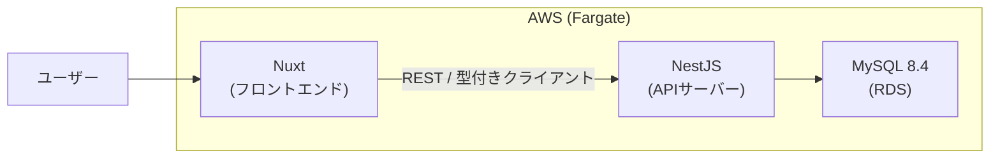
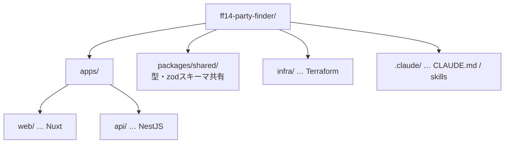
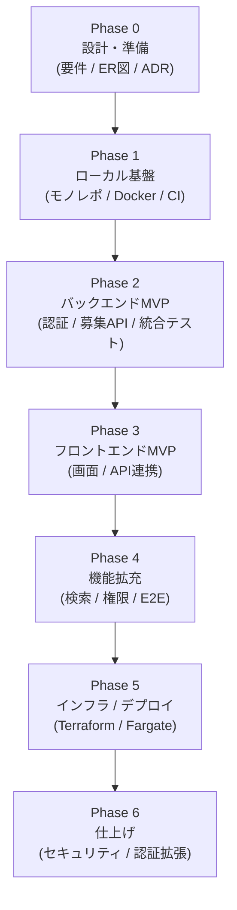

個人開発の題材として、FF14（ファイナルファンタジーXIV）のパーティー募集アプリを作り始めました。

ただ、一番の目的は「アプリを早く完成させること」ではありません。作る過程で自分の技術力を上げることが本当の狙いです。なので、多少オーバースペックでも、あえてモダンでベストプラクティス寄りの構成を選びました。フロントとバックの分離、コンテナ、クラウドへのデプロイまで、ひととおり自分の手で通してみるつもりです。

この連載では、その過程を少しずつ書いていきます。第1回は技術選定の記録です。

## 何を作るのか

FF14 には、一緒にコンテンツへ挑む仲間を探す「パーティ募集」という文化があります。それを Web アプリにしよう、という話です。いきなり全部は作れないので、まずは「募集の作成・一覧・詳細・参加」だけに絞って、そこから育てていきます。

ドメインとして頭に入れておきたいのは、このあたりです。

- サーバーの階層：リージョン > データセンター(DC) > ワールド。DC をまたいだ募集もある
- コンテンツの種別：零式 / 絶 / エキルレ / 討滅戦 / ダンジョン など
- ロール構成：Tank / Healer / DPS の枠、ジョブ単位の空き
- 募集の状態：募集中 / 満員 / 締切 / 開催済み、それに開始時刻やタイムゾーン

FF14 をやっている人には当たり前の話ですが、アプリに落とすとなると、こういう前提をきちんと整理しておく必要があります。

## 選ぶときの軸

学ぶのが目的なので、選定の軸は3つに置きました。

1. モダンでベストプラクティスな構成であること
2. できるだけ新しいメジャーバージョンを使うこと
3. 仕事で触れている Vue / Nuxt / AWS / MySQL を土台にすること

3つ目は、業務で得た知識を活かせるし、逆にここで得た学びを仕事に還元できる、という狙いです。

## 決めた構成

いろいろ調べて、最終的にこの構成に落ち着きました。

| 領域 | 採用 |
| :--- | :--- |
| モノレポ | pnpm workspaces |
| フロントエンド | Nuxt 4 / Vue 3 / Nuxt UI / Pinia |
| バックエンド | NestJS（フロントと分離した独立API） |
| ORM / DB | Drizzle ORM / MySQL 8.4 LTS |
| 認証 | メール＋パスワード（先）→ Discord ログインは後で追加 |
| テスト | Vitest（単体）/ SuperTest ＋ Testcontainers（統合）/ Playwright（E2E） |
| IaC | Terraform |
| デプロイ | Docker / AWS ECS Fargate / ECR / RDS / ALB |
| CI/CD | GitHub Actions |

全体としては、こんな形を目指しています。



コードはモノレポにまとめて、役割ごとにパッケージを分けます。



## 迷ったところと、その決め手

すんなり決まらなかったところを、忘れないうちに残しておきます。

### フロントとバックを分けるかどうか

Nuxt だけで API まで兼ねる（フルスタックにする）手もあります。手軽なのはそっちです。でも今回はあえて分けました。責務がはっきり分かれるし、独立してデプロイやスケールができるし、API 設計・CORS・型の共有・CI/CD を2系統回すといった、実務でよく出てくる話をまとめて経験できるからです。手間は増えますが、その手間こそが今回の学びどころだと思っています。

### バックエンドは NestJS

分離した API サーバーには NestJS を選びました。DI・モジュール・Guard みたいな、少し大げさなくらいカッチリした設計の型を体系的に学べるのが理由です。軽量な Hono も最後まで迷いましたが、今回は「設計の作法を身につける」方を優先しました。

### ORM は Drizzle

ここは最後まで Prisma と迷いました。Prisma はスキーマファーストで分かりやすく、Studio でデータを目で見られて、情報量も多い。入り口のやさしさなら間違いなく Prisma です。

それでも Drizzle を選びました。今回の目的が「作る過程で技術力を上げること」だからです。正直 DB まわりの知識はまだ浅くて、だからこそ SQL から遠ざかりたくない。Drizzle は `db.select().from(...).where(...)` のようにほぼ SQL の形で書けるので、書くほど SQL 力が付きます。型は TypeScript の推論そのままで効くし、スキーマも TS で定義できる。学習の題材としては、抽象に頼りすぎない Drizzle の方が今の自分には合っていると判断しました。マイグレーションは drizzle-kit、データ確認は Drizzle Studio と、まわりのツールも一通り揃っています。

手厚さでは Prisma に譲る場面もあると思いますが、そこで詰まって調べること自体が学びになるはず、と割り切っています。

### 認証はメール＋パスワードから

はじめは Discord ログインから作るつもりでした。FF14 プレイヤーは Discord 利用率が高いので。ただ、Discord を使っていない人もいることを考えると、最初からそれ必須にするのは違うなと。まずは誰でも使えるメール＋パスワードを土台にして、Discord ログインや連携は後から足す方針にしました。

### IaC は Terraform

インフラはコードで管理したいので Terraform を採用。マルチクラウドの定番で、汎用スキルとして持っておく価値が高いのが決め手です。`state` 管理や module の切り方も、この機会に覚えます。

## MySQL のバージョンとローカルのポート

「新しいバージョンを使いたい」一方で、仕事でも MySQL を使っているので、環境がぶつからないか気になりました。整理するとこうです。

- バージョンは 8.4 LTS。新しめの LTS で、AWS RDS も対応しているので本番と揃えられます（9.x 系は Innovation で本番向きではない）
- ローカルは Docker コンテナで隔離されるので、仕事の MySQL とはバージョンもデータも干渉しない
- 唯一ぶつかりうるのがホストのポート。仕事で使う `3306〜3606` を避けて、ホスト側を `13306` にしました

```yaml
services:
  db:
    image: mysql:8.4
    ports:
      - "13306:3306"   # ホスト13306 → コンテナ3306。仕事のMySQLと衝突しない
```

コンテナの中は 3306 のままなので、アプリ側の接続設定は素直に書けます。

## これからの進め方

全体を7つのフェーズに分けました。各フェーズの最後に「動くもの・テスト・この連載の記事」をワンセットで残していく予定です。



## まとめ

第1回は、題材と技術選定を固めるところまででした。

- 目的は「完成」より「作る過程での学習」。だからあえて分離構成・コンテナ・IaC まで踏み込む
- 構成は Nuxt / NestJS / Drizzle / MySQL 8.4 / Terraform / Fargate
- 認証はまずメール＋パスワードから、Discord は後で
- 仕事の MySQL とはコンテナで隔離し、ローカルポートは `13306` で衝突を回避

次回は Phase 0 の続き、要件定義と ER 図の話です。詰まったところや、選び直した判断も正直に書いていきます。
