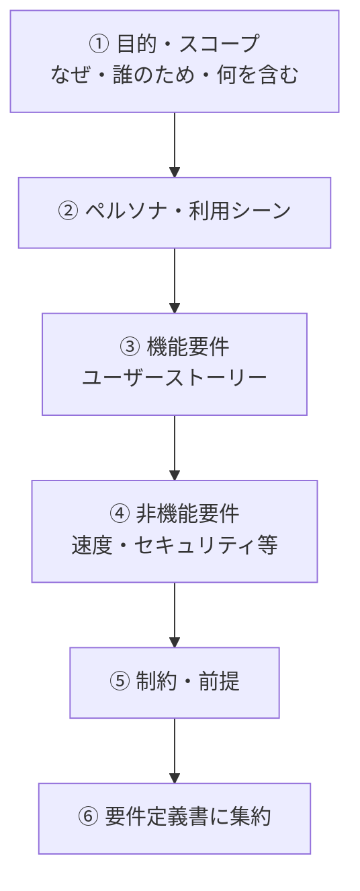
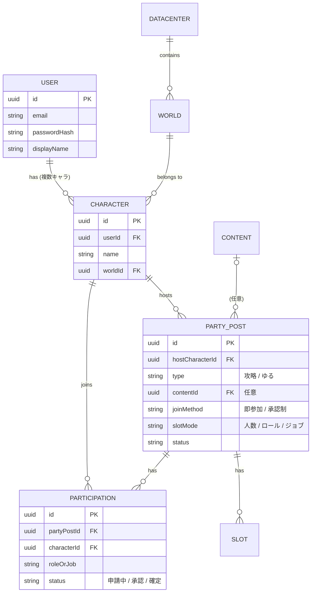
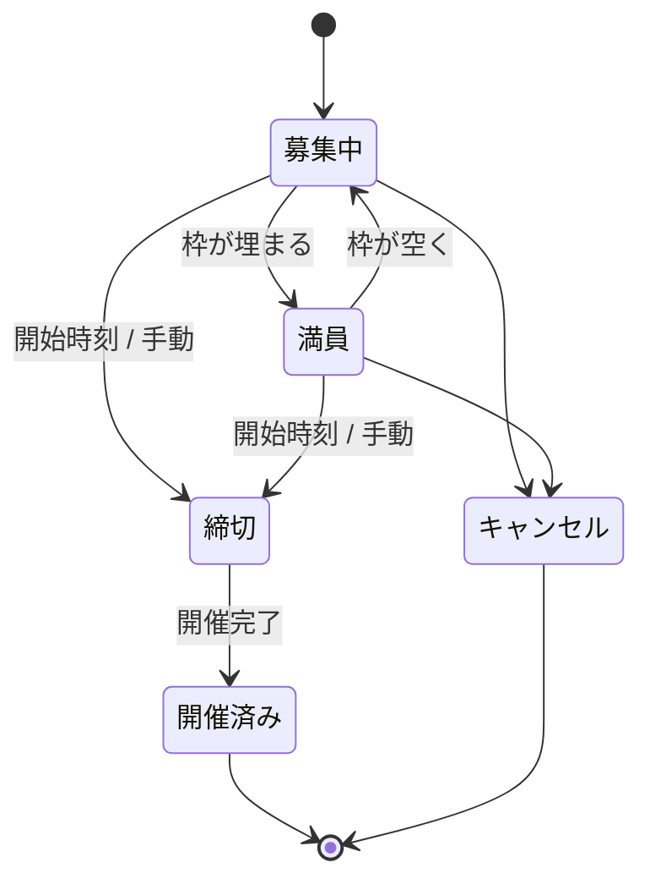
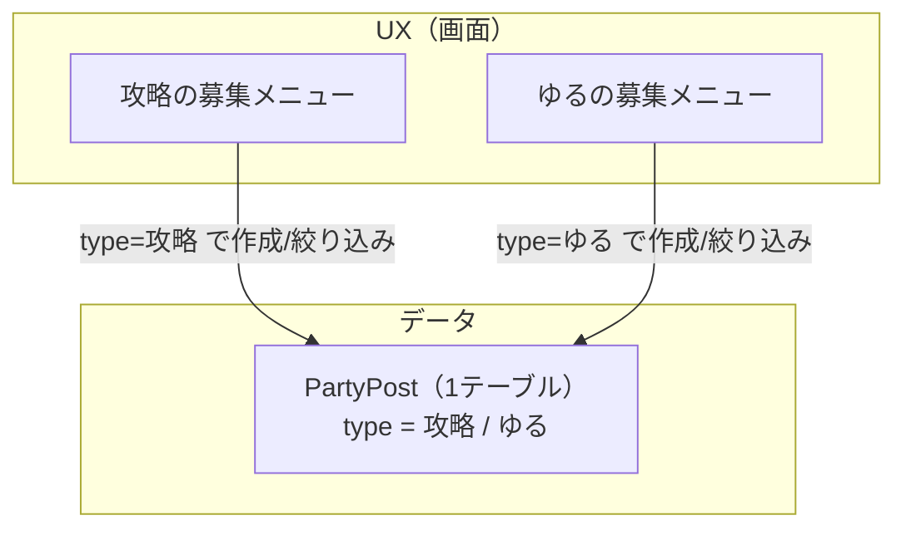

FF14 パーティー募集アプリ開発の連載、第3回です。前回までで GitHub まわりの土台が整ったので、今回はいよいよ**設計フェーズ**——**要件定義とドメインモデリング**に入ります。

要件定義は一人でやったことがなかったので、AI に質問を投げてもらいながら**対話形式**で進めました。その過程で「作るもの」だけでなく「なぜ・誰のため」が固まっていく感覚が新鮮だったので、記録に残します。

## まず「作る前に決める」

要件定義のコツは、機能を並べる前に **「なぜ作るのか・誰のためか」を先に決める**ことだと学びました。ここがブレると機能はいくらでも増えてしまいます。そこで最初に土台を固めました。

## ビジョン：何が不満で、何を作るか

現状、FF14 のパーティー募集はロードストーンの「日記」機能で行われていますが、**使いにくい**という不満があります。そこで、**使いやすい専用の募集アプリ**を作ることにしました。特に大事にしたい価値は次の3つです。

1. **目的の分離** — 真面目な攻略募集（絶・零式など）と、ゆるいメンバー集め（SS撮影会・演奏会など）が混在して使いにくい。これを分けて扱う。
2. **実力・実績の可視化**（将来） — 高難易度ではメンバーの実力を知りたい。ロードストーン連携で見られるように。
3. **ゲーム内 PF にない価値** — ゲーム外での事前募集、履歴・実績、長期募集、Discord 連携。

まずは**自分と友人が使う小規模**から。学習が主目的なので、速度より学びを優先します。

## スコープ：MVP と後回しを分ける

「やりたいこと」は多いので、**MVP と後回しを分ける**のが要件定義の肝です。

| | 機能 |
| :--- | :--- |
| **MVP（今作る）** | メール＋パスワード認証／複数キャラ登録／募集の CRUD ＋参加／目的の分離（攻略・ゆる）／参加方式（即参加・承認制）を募集ごとに選択／枠指定（人数・ロール・ジョブ）の切り替え |
| **バックログ（後で）** | ロードストーン連携／ロール・ジョブ詳細検索／履歴・実績／Discord ログイン・連携／長期・定期募集／リアルタイム更新 |

## ドメインモデル：登場人物と ER 図

要件が固まると、自然と**データモデルの骨格**が見えてきます。今回の対話から浮かんだ登場人物（エンティティ）を ER 図にしました。

ポイントは、**募集も参加も「キャラクター単位」**で扱うこと。所属ワールドやロールはキャラに紐づくので、「どのキャラで募集/参加するか」を選ぶのが自然です。1 アカウントが複数キャラ（サブキャラ）を持てるのも FF14 らしい要件です。

## 募集の状態遷移

募集がたどるライフサイクルも整理しました。

## 今回の一番の学び：UX は分ける、テーブルは分けない

対話の中で一番おもしろかった設計判断がこれです。

「攻略とゆる募集は、同じ画面ではなく**メニューごと分けたい**。そうするとテーブルの概念も変わる？」——直感的にはテーブルも分けたくなります。でも整理すると、こう気づきました。

> **「画面（UX）を分ける」と「テーブルを分ける」は別の軸。** 画面は分けつつ、データは1つのテーブルに種別フラグを持たせれば両取りできる。

攻略とゆるは、募集主・開始日時・締切・状態・**参加**といった**共通部分が圧倒的に多い**。テーブルを分けると、この共通処理（参加・一覧・検索）が二重管理になり、「自分の募集一覧」を出すのに UNION が要る…と苦労が増えます。そこで、

- **単一テーブル ＋ 種別フラグ（`type`）** にする
- 種別ごとの**条件付きバリデーション**で差分を吸収（攻略はコンテンツ/ロール枠、ゆるは人数）

としました。UX の分離欲求は満たしつつ、データは綺麗に保てます。将来 type 固有の項目が増えすぎたら、その時に詳細テーブルへ分ければよく、**今から作り込まない**のが定石です。

## 認証はメール＋パスワードから

当初は Discord ログインを先に考えていましたが、**「Discord を使わない FF14 プレイヤーもいる」**という点から方針を変えました。まず**万人が使えるメール＋パスワード**を基盤にし、Discord ログイン/連携は後から足します。パスワードの適切なハッシュ化やセッション管理を自分で実装する、という学びの機会にもなります。

## まとめ

- 要件定義は「機能を並べる前に、**なぜ・誰のため**を決める」
- **MVP と後回しを分ける**ことでスコープの膨張を防ぐ
- 要件が固まると**ドメインモデル（ER図）**が自然に見えてくる
- 設計の勘所：**UX は分けてもテーブルは分けない**（共通処理を一元化する）
- 認証はまず**メール＋パスワード**から

次回からは Phase 1、**ローカル開発基盤**（モノレポの依存導入・Lint/Format・Docker Compose・テスト）に手を動かしていきます。
