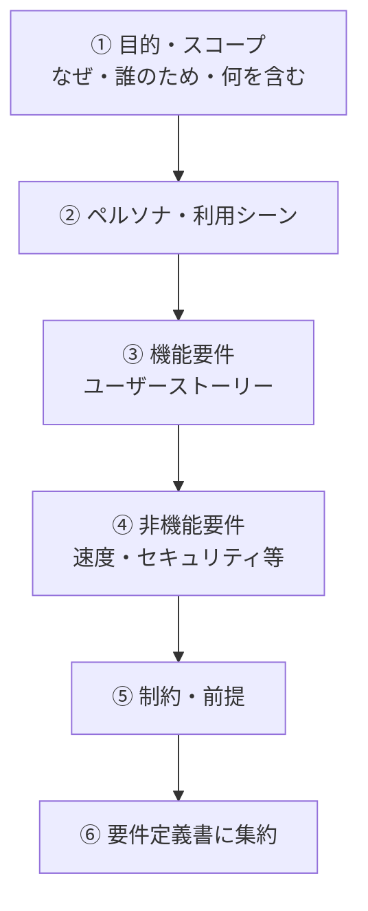
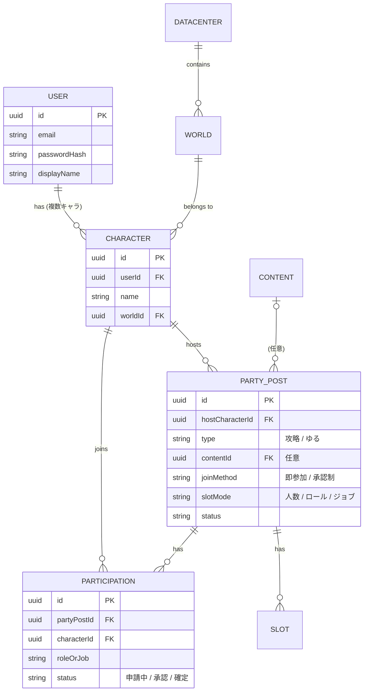
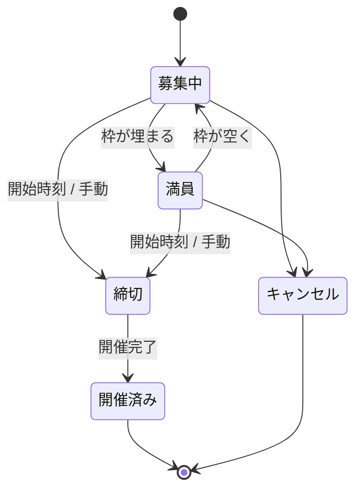
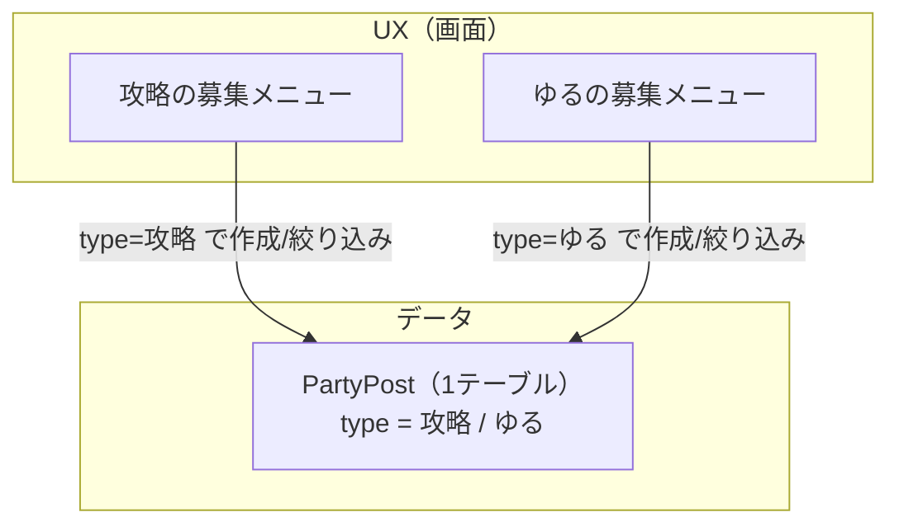

連載3回目です。前回で GitHub まわりの土台ができたので、いよいよ設計に入ります。今回は要件定義とドメインモデリング。

正直に言うと、要件定義をちゃんと一人でやるのは初めてでした。最初は何から手をつけていいのか分からず、とりあえず「自分は何を作りたいんだっけ？」を書き出すところから始めています。手を動かしているうちに、作るものより先に「なぜ・誰のために作るのか」が固まっていく感覚があって、これが思ったより面白かったので記録に残しておきます。

## 機能より先に「なぜ・誰のため」を決める

やってみて一番腑に落ちたのが、機能を並べる前に「なぜ作るのか・誰のためか」を先に決める、という順番でした。ここが曖昧なままだと、あれもこれもと機能が際限なく増えてしまう。逆にここさえ固まっていれば、後から迷ったときに「それは目的に合ってる？」で切り分けられます。

だいたいこんな順番で上から詰めていきました。

## そもそも何が不満で、何を作りたいのか

FF14 のパーティ募集って、いまはロードストーンの「日記」機能でやるのが主流なんですが、これがなかなか使いづらい。募集を探すのも立てるのも、正直しんどいと感じていました。だったら自分で使いやすい募集アプリを作ってしまおう、というのが出発点です。

作りながら特に大事にしたいと思ったのが、次のあたりでした。

- **目的で分ける**。真面目な攻略募集（絶・零式など）と、SS撮影会や演奏会みたいなゆるい集まりが、いまは同じ場所に混ざっていて探しづらい。ここを分けたい。
- **実力・実績が見える**（これは将来）。高難易度だと、どうしても一緒に行く人の練度が気になる。ロードストーン連携でそのあたりが見えると嬉しい。
- **ゲーム内の募集にはない価値**。ゲームを起動していなくても事前に募集できる、履歴が残る、長期の固定募集も扱える、あたり。

利用者はまず自分と友人だけの小さい範囲から。目的はあくまで学習なので、完成を急ぐより、丁寧に作ることを優先します。

## どこまで作るか（MVP と後回し）

やりたいことを全部書き出したら、案の定、多すぎました。ここで全部やろうとすると絶対に終わらないので、「最初に作る分（MVP）」と「後回し」に線を引きます。この線引きこそ要件定義の山場だと思います。

| | 機能 |
| :--- | :--- |
| **MVP（まず作る）** | メール＋パスワード認証／複数キャラ登録／募集の CRUD ＋参加／目的の分離（攻略・ゆる）／参加方式（即参加・承認制）を募集ごとに選べる／枠指定（人数・ロール・ジョブ）の切り替え |
| **後回し** | ロードストーン連携／ロール・ジョブでの詳細検索／履歴・実績／Discord ログイン・連携／長期・定期募集／リアルタイム更新 |

## 登場人物を洗い出す（ドメインモデル）

要件がある程度固まってくると、不思議と「データの形」が見えてきます。募集アプリに出てくる登場人物（エンティティ）を並べて、関係を ER 図に落としてみました。

ここで一つこだわったのが、募集も参加も「キャラクター単位」で扱うところです。所属ワールドもロールもキャラに紐づくものなので、「アカウント」ではなく「どのキャラで募集/参加するか」を選ぶ形が自然でした。FF14 はサブキャラを持っている人も多いので、1 アカウントで複数キャラを登録できるようにしています。

## 募集のライフサイクル

募集がどんな状態を行き来するのかも、先に整理しておきました。

## いちばん悩んだところ：画面は分ける、でもテーブルは分けない

今回、設計で一番手が止まったのがここでした。

攻略募集とゆる募集は、同じ画面に並べるんじゃなく、メニューからして分けたい。ここまではすんなり決まりました。問題はその次で、「画面を分けるなら、テーブルも分けるべきなんじゃないか？」と手が止まったんです。攻略用のテーブルとゆる用のテーブル、みたいに。

しばらく考えて、ようやく腑に落ちたのがこれでした。

> 「画面（UX）を分ける」ことと「テーブルを分ける」ことは、別の話。画面は分けつつ、データは1つのテーブルに種別フラグを持たせれば両立できる。

冷静に見ると、攻略もゆるも、募集主・開始日時・締切・状態、そして参加まわりはほとんど同じなんですよね。ここでテーブルを分けてしまうと、参加や一覧や検索といった共通の処理を二重に持つことになる。「自分の募集一覧（攻略もゆるも混ぜて）」を出すだけで UNION が要る、みたいな面倒がついて回ります。

なので、

- テーブルは1つにして、`type`（攻略 / ゆる）の種別フラグを持たせる
- 種別ごとの違いは、条件付きのバリデーションで吸収する（攻略はコンテンツやロール枠、ゆるは人数だけ、など）

という形に落ち着きました。画面を分けたい気持ちは満たしつつ、データはすっきり保てます。将来、種別ごとに固有の項目がどうしても増えてきたら、そのとき初めて詳細テーブルに切り出せばいい。先回りして作り込まないのが結局ラク、というのは今回の学びでした。

## 認証はメール＋パスワードから

最初は Discord ログインから作るつもりでした。FF14 プレイヤーは Discord 利用率が高いので。ただ、よく考えると Discord を使っていない人もそれなりにいる。そういう人を最初から締め出すのも違うなと思い直して、まずは誰でも使えるメール＋パスワードを土台にすることにしました。Discord ログインや連携は、その上に後から足していきます。

パスワードのハッシュ化やセッション管理を自分の手で実装することになるので、これはこれで良い勉強になりそうです。

## まとめ

- 要件定義は、機能を並べる前に「なぜ・誰のため」を決めるところから
- やりたいことは必ず膨らむので、MVP と後回しに線を引く
- 要件が固まると、ドメインモデル（ER図）が自然と見えてくる
- 画面は分けても、共通処理が多いならテーブルは分けない
- 認証はまずメール＋パスワードから

次回からはいよいよ Phase 1、ローカルの開発環境づくりに手を動かしていきます。
