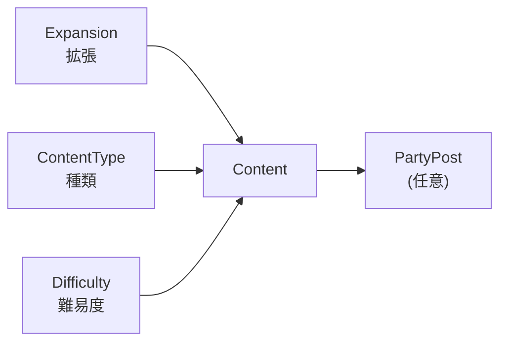

連載5回目。前回でデータモデルを実装に耐える形まで作り込みました。今回はその続きで、このアプリの**本丸**である「検索」の設計です。

作っているうちに、だんだんハッキリしてきたことがあります。このアプリの価値って、結局**「見たい募集にすぐ辿り着けるか」**でほぼ決まるんですよね。募集を作る側の機能はどのアプリも似たり寄ったりで、差がつくのは探す側。だから検索の軸は、片手間じゃなくちゃんと設計することにしました。

## このアプリは結局「検索」で決まる

まず「そもそも何で絞りたいか」を、自分がプレイヤーとして募集を探すときの気持ちで書き出しました。

- どのコンテンツか（どの拡張の、何の、どの難易度か）
- 自分のロール／ジョブの枠が空いているか
- どんな雰囲気か（初見歓迎なのか、ガチなのか、まったりなのか）
- 単発か、それとも固定（定期的に集まる）募集か

これを1つずつ、データモデルのどこで受けるか、に落としていきます。

## コンテンツをどう絞るか（拡張・種類・難易度）

前回、コンテンツはとりあえず「Content 1テーブル」でざっくり持っていました。でも検索の入口として考えると、これでは全然足りません。実際に探すときは、

- **拡張（バージョン）**：黄金のレガシーか、暁月のフィナーレか
- **種類**：ダンジョンか、討滅戦か、レイドか、FATE か
- **難易度**：ノーマルか、零式か、絶か、極か

という3つの軸で絞りたい。なので、この3つをそれぞれ**マスタテーブル**にして、Content がそれぞれを参照する形にしました。

ここで一つ迷ったのが、「種類」と「難易度」をどう組み合わせるかでした。というのも、この2つは**全部の組み合わせが有効なわけじゃない**んですよね。絶はレイド、極は討滅戦にしか無いし、FATE やモブハントに難易度は無い。

最初はこの「有効な組み合わせ」をテーブルで縛ろうとしたんですが、すぐに複雑になって挫折しました。結局、**3つを独立した参照にして、難易度は任意（無くてもいい）**にして、組み合わせの妥当性はアプリ側のバリデーションで緩く見る、というところに落ち着きました。零式・絶は「レイドの難易度」なので、難易度として持つのが自然です。

## 「雰囲気」で絞りたい、でも攻略とゆるで意味が違う

次が「雰囲気」です。初見歓迎／練習／クリア目的／まったり……みたいなやつ。最初は素直に「雰囲気タグ」を作って、募集に複数付けられるようにしよう、と考えました。

……が、ここで手が止まりました。**そもそも攻略とゆるは、メニューからページを分ける**というのが、このアプリの根っこの方針だったはずです（第3回で決めた話）。だとすると、雰囲気タグを両方で共有するのは変じゃないか？と。

しばらく考えて気づいたのは、**雰囲気の"中身"が攻略とゆるで違う**、ということでした。

- 攻略ページの雰囲気：初見歓迎 / 練習 / クリア目的 / 消化
- ゆるページの雰囲気：まったり / わいわい / 撮影会 / 演奏

つまり「複数付けられるのが変」なんじゃなくて、「両ページで同じタグ集合を共有するのが変」だったんです。だからタグに**「どっちのページ用か」という属性**を持たせて、ページごとに出す候補を分けることにしました。こうすれば、攻略で「初見歓迎＋練習」、ゆるで「まったり＋雑談」みたいに複数付けるのも、ちゃんと意味を持ちます。

大分類（攻略 / ゆる）はページの切り替え、その中の中分類が雰囲気タグ、という二段構えですね。

## 単発か、固定か（活動頻度・期限）

もう一つ入れたかったのが、**固定・長期募集**の軸です。FF14 には「固定」という、決まったメンバーで定期的に集まる文化があって、これは単発の募集とは探し方がまったく違う。「週2で活動できる零式の固定を探す」みたいな。

要件を作ったときは固定募集を「後回し」に置いていたんですが、検索が目的だと考えると、ここは外せないと思い直しました。なので募集に、

- **開催形態**：単発 / 固定
- **活動頻度**（固定のとき）：週1 / 週2 / 毎日 / 不定期
- **活動期限**（固定のとき）：クリアまで / 長期 / 期間限定

を持たせました。ここで一点、自分の中で言葉を整理する必要がありました。「活動期限」と「募集の締切」は別物だ、ということです。活動期限は**固定パーティをいつまで続けるか**の目安。募集の締切は**いつまで応募を受けるか**。混同すると設計がブレるので、別のカラムに分けています。

## ロール・ジョブの空きは、もう設計済みだった

最後、「Tank 枠が空いている募集を探したい」みたいなロール／ジョブでの絞り込み。これ、新しく何か作らないといけないかな…と身構えたんですが、**前回の席ベース設計のおかげで、追加はいりませんでした**。

募集の枠は「1席 = 1レコード」で、席にはロール／ジョブの制約が付いています。なので「Tank の席があって、まだ確定した参加者がいない募集」を探せば、それがそのまま「Tank 枠が空いている募集」になる。席の設計をちゃんとやっておくと、こういうところで効いてくるんだなと実感しました。

## 検索画面のイメージ

ここまでの軸を、画面に並べるとこんなイメージです（ワイヤーフレーム）。

左のサイドバーが、今回設計した検索の軸そのものです。上のタブで攻略／ゆるを切り替えると、雰囲気タグの候補もそれに合わせて変わる。募集カードには、ロール枠の空き（「DPS 1枠空き」）や、単発／固定・頻度が出る、というイメージです。データモデルと画面がちゃんと地続きになっているのが、自分で見ても気持ちいい。

## まとめ

- このアプリの価値は「探しやすさ」。検索の軸はちゃんと設計する
- コンテンツは 拡張／種類／難易度 の3マスタで絞る。組み合わせの妥当性はアプリ側で緩く見る
- 雰囲気タグは「攻略／ゆるのどちら用か」でスコープを分ける。大分類はページ、中分類がタグ
- 単発／固定を軸に入れる。「活動期限（固定の継続）」と「募集の締切」は別物
- ロール／ジョブの空き検索は、席ベース設計のおかげで追加設計なしで実現できた

設計編はこれで一区切りです。次回からは本当に手を動かして、Phase 1 のローカル開発環境と、Drizzle でのスキーマ実装に入っていきます。
