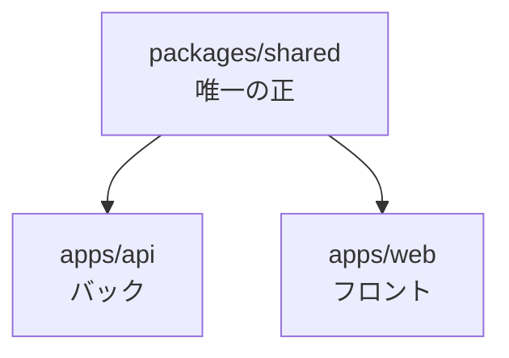

連載7回目。前回はコードを書く前の土台（pnpm や ESLint などのツールチェーン）を整えました。今回からいよいよ**アプリのコード**……なんですが、最初に手をつけたのは画面でもAPIでもなく、`packages/shared` という地味なパッケージです。

これは、**フロント（Nuxt）とバック（NestJS）の両方から使う「共通の型と検証ルール」を1か所にまとめる**場所。なぜ最初にこれなのか、から書いていきます。

## なぜ「共通の置き場」が要るのか

このアプリは、フロントとバックを**別プロジェクトに分離**しています（そういう構成にしたのは学習のため）。すると、同じ概念を両方で二重に書いてしまいがちです。

例えば「参加方式（即参加 / 承認制）」。フロントの募集フォームにも、バックのAPIの入力チェックにも、この選択肢が必要になります。何も考えないと、両方に別々に書くことになる。

```
apps/api（バック）              apps/web（フロント）
  "即参加" | "承認制"     ←ズレる→   "即" | "要承認"
```

そして片方だけ直したときに、もう片方が古いまま残る。これが**地味だけど致命的なバグの温床**です。「バックは新しい値を受け付けるのに、フロントは古い選択肢を出している」みたいなことが起きる。

なので、**「参加方式とは何か」を定義する場所を1つに決めて、フロントもバックもそこを見る**ようにします。これが `packages/shared` の役割です。



「唯一の正（single source of truth）」という言い方をよくしますが、まさにそれを物理的に1パッケージとして用意する、という話です。

## zod で「型・検証・表示」を1つにまとめる

ここが今回いちばん面白かったところです。

ふつう、こういう「決まった選択肢」を扱うとき、次の3つを別々に用意しがちです。

1. **実行時のバリデーション**（バックのAPIで「変な値が来たら弾く」）
2. **コンパイル時の型**（フロントで型補完を効かせる）
3. **表示用のラベル**（画面に「即参加」と出す）

これを別々に書くと、やっぱりズレます。そこで **zod** というライブラリを使うと、**1つの定義から1と2がまとめて手に入る**んです。実際に書いたのがこれ:

```ts
import { z } from 'zod';

// 保存する値は英語コード。1回書くだけ
export const joinMethod = z.enum(['immediate', 'approval']);

// ① 実行時バリデーション（バックのAPIで使う）
joinMethod.parse(req.body.joinMethod); // 変な値なら例外

// ② コンパイル時の型（フロントのフォームで使う）
export type JoinMethod = z.infer<typeof joinMethod>; // 'immediate' | 'approval'

// ③ 表示用ラベル（保存値と表示を分離しておく）
export const joinMethodLabels: Record<JoinMethod, string> = {
  immediate: '即参加',
  approval: '承認制',
};
```

`z.enum([...])` と一度書けば、そこから**バリデーション（`joinMethod`）**も**型（`JoinMethod`）**も導けます。型を別に手書きしないので、値と型が絶対にズレない。ここが zod の気持ちいいところです。

### 保存する値は「英語コード」にした

ひとつ設計判断をしました。DBに保存する値を、日本語（「即参加」）ではなく**英語コード（`immediate`）**にして、日本語は上の `joinMethodLabels` に分離したことです。

要件を書いたときのER図には日本語で「即参加 / 承認制」と書いていましたが、あれは概念の表記。実際に保存する値としては、英語コードのほうが後々ラクだと判断しました。表示文言を「即参加」→「すぐ参加OK」に変えたくなっても、DBのデータやコードの識別子はいじらなくて済む。**保存する値と、見せる文字は、役割が違う**という整理です（この方針は設計メモ ADR-0005 にも沿っています）。

## ファイルの置き方：ドメインごとに分ける

enum はこの先どんどん増えます。募集ひとつ取っても、参加方式・VC・開催形態（単発/固定）・ステータス……とすぐ増える。これを1つの `enums.ts` に全部積むと、あっという間に見通しの悪い数百行のファイルになります。

なので最初から、**「機能（ドメイン）ごとにフォルダを分ける」**構成にしました。

```
packages/shared/src/
├─ party-post/          # 「募集」ドメイン
│  ├─ enums.ts          # joinMethod, voiceChat …（募集の enum）
│  └─ index.ts          # このドメインの入口
└─ index.ts             # パッケージ全体の公開入口（各ドメインをまとめる）
```

「募集に関する型や検証」は `party-post/` に全部まとまっている、という状態です。今後 `participation/`（参加）などが増えても、同じ形でフォルダを足すだけ。技術の種類（enum / schema / type）ではなく**機能で分ける**と、1つの概念を触るときに複数フォルダを往復せずに済みます。

ポイントは、**どう分割しても外からの使い方は変わらない**こと。公開の入口 `src/index.ts` が各ドメインをまとめて re-export しているので、使う側はいつでも `@ff14/shared` から import すれば済みます。

```ts
// src/index.ts — 各ドメインの入口をまとめるだけ
export * from './party-post/index.js';
```

## 「ビルドする / しない」で悩んだ

もう一つ、地味に大きな選択がありました。この共通パッケージを、他のパッケージに**どう読ませるか**です。2つのやり方があります。

- **方式1：ビルドする** — `packages/shared` を「本物のパッケージ」としてコンパイル（`.ts` → `.js` ＋ 型定義 `.d.ts`）し、その成果物を読ませる。
- **方式2：ソースを直接読む** — コンパイルせず、`.ts` の生ソースをそのまま import する。

比較するとこんな感じ:

| | 方式1（ビルド） | 方式2（直接） |
| :--- | :--- | :--- |
| 設定の量 | 多い | 少ない |
| バック(NestJS)との相性 | ◎ 成果物を読むだけ | △ 変換設定が要る |
| 本番ビルドの安定 | ◎ | △ dev では動くが本番で事故りがち |
| 境界の明確さ | ◎ 公開したものだけ見える | △ 内部にも手が届く |
| 手軽さ | △ | ◎ |

手軽なのは断然、方式2です。でも今回は**方式1（ビルドする）**を選びました。理由は、

- フロントとバックで**別々のビルドツール**を使う構成なので、「コンパイル済みの成果物を読むだけ」の方が各アプリで事故が少ない
- 「公開する入口（`index.ts`）に書いたものだけが外から見える」という**境界の明確さ**が好み
- そして何より、モノレポでパッケージをビルドして参照する構成は**実務でそのまま出てくる**ので、学んでおきたかった

学習目的なので、「手軽さ」より「ちゃんとした構成を一度通す」を取った形です。

## ハマったところ：import に `.js` を付ける

方式1でビルド設定（Node の ESM 方式）にしたら、最初につまずいたのがこれです。**`enums.ts` を読み込むのに、import では `enums.js` と書く**。

```ts
// party-post/index.ts — ファイルは enums.ts なのに、拡張子は .js
export * from './enums.js';
```

ファイル名は `.ts` なのに `.js`？と最初は混乱しました。これは Node の ESM の作法で、「**コンパイル後に生成される `.js` を指す**」という約束事なんですね。慣れると理屈は分かるのですが、知らないと確実に手が止まるポイントでした。

## 動くことを確認する

最後に、ビルドした成果物を実際に動かして、狙いどおりかを確かめました。

```
joinMethod.parse('approval')      → 'approval'（正常値は通る）
joinMethodLabels.approval          → '承認制'（表示ラベルが引ける）
joinMethod.safeParse('typo')       → success: false（変な値は弾く）
```

1つの `z.enum` 定義から、**検証も・型も・表示も**ちゃんと出てきました。フロントの入力フォームとバックのAPI検証が、この定義を共有できる状態になった、ということです。

## フロントとバックから、どう使うか

作った `@ff14/shared` を、実際に両側から使うとこうなります。どちらも `@ff14/shared` から import するだけです（内部のフォルダ構成は意識しなくてよい）。

バック（NestJS）— APIに来た値を検証する:

```ts
import { joinMethod } from '@ff14/shared';

// 変な値なら例外を投げてくれる。不正な入力をここで止める
const value = joinMethod.parse(body.joinMethod);
```

フロント（Nuxt）— 型補完・表示ラベル・選択肢を使う:

```ts
import { joinMethod, joinMethodLabels, type JoinMethod } from '@ff14/shared';

// 型が効くので 'immediate' | 'approval' 以外は書けない（タイプミスを防ぐ）
const selected: JoinMethod = 'approval';

// 画面には日本語で「承認制」と出す
const label = joinMethodLabels[selected];

// セレクトボックスの選択肢も定義から作れる
const options = joinMethod.options; // ['immediate', 'approval']
```

同じ `joinMethod` を、バックは「検証」に、フロントは「型・表示・選択肢」に使う。定義は1か所なので、たとえば選択肢を1つ増やしたら、両側に自動で反映されます。**二重管理が構造的に起きない**のが、この共通パッケージの一番の狙いです。

## まとめ

- フロント/バックを分離すると、同じ概念の二重定義でズレる。`packages/shared` を「唯一の正」にして防ぐ
- **zod は1つの `z.enum` から「バリデーション・型・表示ラベル」をまとめて出せる**。値と型が絶対にズレない
- 保存する値（英語コード）と、見せる文字（日本語ラベル）は分けておくと後がラク
- enum は増えるので、最初から**ドメイン（機能）ごとにフォルダで分ける**。公開の入口は1つなので、分割しても使う側の import は変わらない
- 共通パッケージは「ビルドして成果物を読ませる」方式を選んだ。手軽さより、バックとの相性・境界の明確さ・学びを優先
- Node の ESM では、import の拡張子は `.js`（ソースが `.ts` でも）

まだ enum を2つ置いただけの小さなパッケージですが、**フロントとバックが同じ言葉で話せる土台**ができました。次回はいよいよ Docker で MySQL を立てて、Drizzle でスキーマを書きます。そこで、この shared に置いた enum と実際のデータベースがつながっていく予定です。
