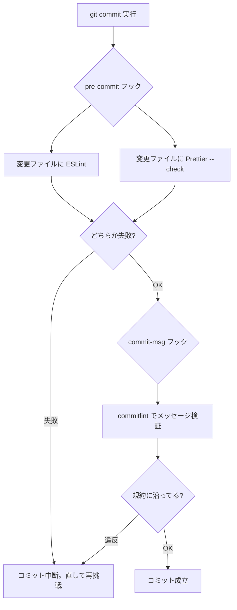

連載6回目。前回までの設計編（要件・データモデル・検索）で、頭の中はだいぶ固まりました。ここからはいよいよ手を動かすフェーズ、**Phase 1「ローカル開発基盤」**に入ります。

……なんですが、今回はまだアプリのコードは1行も書きません。書くのは設定ファイルばかりです。**pnpm / TypeScript / ESLint / Prettier / lefthook / commitlint** という、開発を支える「土台（ツールチェーン）」を先に整える回です。

このプロジェクトは「アプリを完成させること」より「開発を通じて学ぶこと」が目的なので、こういう地味な土台こそ、**なぜそれが必要で、何をしてくれるのか**を自分の言葉で説明できるようにしておきたい。今回はその整理です。

## なぜ、コードより先に土台なのか

正直、最初は「さっさと Nuxt と NestJS を立ち上げて動かしたい」という気持ちがありました。でも、経験上そこで焦ると後で痛い目を見ます。

たとえば、コードを100ファイル書いた**後**で「やっぱり Prettier 入れよう」となると、その瞬間に全ファイルが整形対象になって、巨大な差分が出ます。「ESLint のルールを厳しくしよう」も同じ。土台を後から入れるほど、既存コードとの摩擦が大きくなる。

だから先に規律（ルール）を敷いて、**1行目のコードから既にそのルールに従っている**状態を作る。これがツールチェーンを最初にやる理由です。今回入れたものを役割で並べるとこうなります。

| ツール | 役割 | ざっくり言うと |
| :--- | :--- | :--- |
| pnpm | パッケージ管理 | ライブラリの導入。モノレポの土台 |
| TypeScript (strict) | 型チェック | 実行前にバグを見つける |
| ESLint | 静的解析（Lint） | 「バグりやすい書き方」を検出 |
| Prettier | 整形（Format） | コードの「見た目」を自動で統一 |
| commitlint | コミット規約 | コミットメッセージの形式を強制 |
| lefthook | Git フック | コミット時に上記を自動で走らせる |

以下、なぜそれを選んだかを1つずつ。

## pnpm と corepack ― 「誰がやっても同じ」を作る

パッケージマネージャは **pnpm** を選びました。理由は、モノレポ（複数のアプリを1リポジトリで管理する構成）との相性が良いこと、ディスク効率が良いこと、そして仕事でも使っていて馴染みがあることです。

ここで1つ大事にしたのが、**pnpm 自体のバージョンを固定する**ことでした。使ったのは Node に同梱されている **corepack** という仕組みです。`package.json` にこう書いておきます。

```json
{
  "packageManager": "pnpm@11.11.0+sha512.4463f6..."
}
```

こうしておくと、このリポジトリでは誰が触っても（別のPCでも、CI上でも）**必ず pnpm 11.11.0 が使われる**。「自分のPCでは動くのに、他では動かない」の原因の多くは、こういうツールのバージョン差なので、最初に潰しておきます。ハッシュ（`sha512...`）まで付くのは、なりすまし対策で「本当にそのバージョンか」を検証するためです。

## TypeScript は strict、そして「なるべく厳しく」

型の設定は、共通の土台となる `tsconfig.base.json` を1つ作り、各パッケージ（フロント・バック・共通）はそれを継承する形にしました。中身は `strict` を有効にした上で、さらに厳しめのオプションを足しています。

```json
{
  "compilerOptions": {
    "strict": true,
    "noUncheckedIndexedAccess": true,
    "noImplicitOverride": true,
    "noUnusedLocals": true,
    "noUnusedParameters": true
  }
}
```

`strict` は「型に関する基本的な厳しさ（`null` チェックなど）」を一括で有効にするスイッチです。学習目的なので、そこに加えて特に入れたかったのが **`noUncheckedIndexedAccess`**。これは配列やオブジェクトを添字で取り出したとき、結果を「値 or `undefined`」として扱わせるオプションです。

```ts
const arr = ['a', 'b'];
const x = arr[10]; // これは実行時 undefined
// noUncheckedIndexedAccess ありだと、x は string | undefined 型になり、
// undefined チェックを忘れるとコンパイルエラーで教えてくれる
```

「実行してみたら undefined でクラッシュ」を、型の段階で防いでくれる。厳しいぶん書くのは少し面倒になりますが、そのぶん学べるので今回は倒しておきました。

### 型チェックの入口は「空っぽの司令塔」

もう1つ、ルートに `tsconfig.json` を置きました。これは自分ではコードを持たず、各パッケージを束ねる「司令塔」の役割です。

```json
{
  "extends": "./tsconfig.base.json",
  "files": [],
  "references": []
}
```

`references`（プロジェクト参照）に、今後 `apps/web`・`apps/api`・`packages/shared` を足していきます。`pnpm typecheck`（中身は `tsc --build`）を叩けば、ここを起点に全パッケージの型チェックが一括で走る。今はまだパッケージが無いので中身は空ですが、**箱だけ先に用意**しておくイメージです。

### ハマりどころ①：最新の TypeScript 7 が使えなかった

このプロジェクトは「なるべく新しいメジャーバージョンを使う」方針でやっています。なので当然、入れた瞬間は最新の **TypeScript 7.0** が入りました。これは TypeScript の実装が Go言語で書き直された、いわゆるネイティブ版です。

……が、この後の ESLint の設定で、盛大にクラッシュしました。

```
TypeError: Cannot read properties of undefined (reading 'Cjs')
    at .../@typescript-eslint/typescript-estree/...
```

原因を調べると、**ESLint に TypeScript を理解させるためのライブラリ（typescript-eslint）が、まだ TypeScript 7 に対応していなかった**んです。対応範囲を確認すると `>=4.8.4 <6.1.0`。つまり TS7 どころか TS6.1 以降もダメ。ネイティブ版で内部構造が変わり、周辺ツールがまだ追いついていない、という過渡期のトラブルでした。

ここで学びになったのは、**「最新」には2種類ある**ということ。「言語本体の最新」と「エコシステム全体がついてこれている最新」は違う。今回は後者を優先して、対応範囲に収まる中で一番新しい **TypeScript 6.0.3 に固定**しました。ツール群が TS7 に追いついたら上げればいい。新しさを追うのは良いけど、**足並みの揃っている新しさ**を選ぶ、という感覚が掴めた気がします。

## ESLint と Prettier ― 役割が違う2つ

この2つはよく一緒に語られますが、**やることは別物**です。ここを分けて理解するのが大事でした。

- **ESLint（Lint）**：コードの「意味」を見る。使ってない変数、バグりやすい書き方、危険なパターンを検出する。
- **Prettier（Format）**：コードの「見た目」を整える。インデント、クォート、改行、行の折り返しを機械的に統一する。

「バグの検出（ESLint）」と「見た目の統一（Prettier）」は関心が別なので、道具も分ける。そしてこの2つは、放っておくと**喧嘩します**（例：ESLint が「セミコロンを付けろ」、Prettier が「消せ」と主張して無限ループ）。それを防ぐのが `eslint-config-prettier` で、これは「見た目に関するルールは Prettier に任せるから ESLint 側は黙ってろ」という設定です。ESLint の設定ファイルで、**必ず最後に**これを適用します。

```js
// eslint.config.mjs（ESLint 9+ の "flat config" 形式）
export default tseslint.config(
  { ignores: ['**/dist/**', '**/.nuxt/**', ...] },
  js.configs.recommended,          // ESLint 標準の推奨ルール
  ...tseslint.configs.recommended, // TypeScript 向けの推奨ルール
  prettier,                        // ← 最後。見た目系ルールを無効化して衝突を防ぐ
);
```

`flat config` というのは ESLint の新しい設定の書き方で、設定を「配列で上から順に適用する」という素直な形式です。後ろに書いたものが前を上書きするので、衝突を消す `prettier` を末尾に置くわけです。

### ハマりどころ②：Prettier が日本語の表を破壊する

Prettier を全ファイルにかけたら、既存の**日本語ドキュメント（Markdown）の表**が軒並み崩れました。Prettier は表の列幅を「文字数」で揃えようとするんですが、日本語の全角文字は「1文字」でも見た目の幅は2倍ある。この差を吸収してくれないので、全角を含む表が大量の余白でガタガタになる、という既知の挙動でした。

対処はシンプルに、**Markdown を Prettier の対象から外す**。`.prettierignore` に `*.md` を足しました。ドキュメントは Obsidian や手書きの体裁を尊重して、Prettier はコードと設定ファイル（TS/JS/JSON/YAML）だけ担当する、という線引きです。ツールは万能じゃないので、**得意なところだけ任せる**判断も必要なんだなと。

## lefthook と commitlint ― ルールを「人の意志」に頼らない

ここまでで「型チェック」「Lint」「整形」「コミット規約」の道具は揃いました。でも、**それを毎回手で走らせるのは絶対に忘れます**。人間なので。

そこで **Git フック**の出番です。Git には「コミットの直前」「コミットメッセージ確定時」などのタイミングで自動的にスクリプトを走らせる仕組みがあり、それを管理しやすくするのが **lefthook** です。設定はこれだけ。

```yaml
# lefthook.yml
pre-commit: # コミットの直前に走る
  parallel: true
  commands:
    lint:
      glob: "*.{js,mjs,cjs,ts,tsx,vue}"
      run: corepack pnpm exec eslint {staged_files}
    format:
      glob: "*.{js,mjs,cjs,ts,tsx,vue,json,yml,yaml,css,scss}"
      run: corepack pnpm exec prettier --check {staged_files}

commit-msg: # コミットメッセージが確定したときに走る
  commands:
    commitlint:
      run: corepack pnpm exec commitlint --edit {1}
```

やっていることは2つ。

1. **pre-commit**：コミットしようとした瞬間、変更したファイルにだけ ESLint と Prettier を走らせる。引っかかればコミットは中断される。
2. **commit-msg**：コミットメッセージが規約（後述）に沿っているかを commitlint でチェックする。

`{staged_files}` は「今コミットしようとしているファイル」だけを指すので、リポジトリ全体ではなく差分だけを速くチェックできます。

### commitlint で「コミットメッセージの型」を強制する

commitlint は **Conventional Commits** という規約を強制します。これは「`種別: 説明`」という形式で、たとえば：

- `feat: ユーザー登録機能を追加`
- `fix: 締切のバリデーションを修正`
- `chore: ツールチェーンを整備`

先頭の種別（`feat`/`fix`/`chore` など）が無いと弾かれます。実際に試すと、こうなります。

```
$ echo "update stuff" | commitlint
✖   subject may not be empty [subject-empty]
✖   type may not be empty [type-empty]
✖   found 2 problems
```

なぜ形式を強制するかというと、**後で機械的に読めるコミット履歴**になるから。「どれが機能追加で、どれが修正か」が一目で分かり、将来リリースノートの自動生成なんかにも使えます。今のうちから型にはめておく、という投資です。

### コミットの流れを図にすると

今回作った仕組みで、`git commit` したときに何が起きるかを整理するとこうです。



大事なのは、この検問を**自分の意志ではなく仕組みが自動でやってくれる**こと。うっかり Lint 違反のままコミット、が構造的に起きなくなります。

### ハマりどころ③：Git フックから pnpm が見つからない（と、nodenv の落とし穴）

最初のコミットで、フックが一発で落ちました。

```
┃  lint ❯
sh: pnpm: command not found
```

理由は、僕が pnpm を **`corepack pnpm` として呼んでいて、素の `pnpm` を PATH に通していなかった**から。ターミナルでは `corepack pnpm ...` と打てば動くけど、Git フックは最小限の環境で `pnpm ...` を実行するので「そんなコマンド無い」となる。

とっさに「じゃあフックを `corepack pnpm exec ...` にすればいい」と回避したんですが、後で「**そもそも `pnpm` を PATH に通せばいいのでは？**」と考え直しました。フックが冗長になるし、普段も素の `pnpm` を打てた方が気持ちいい。で、これがちょうど **nodenv の仕組みを理解する良い題材**になりました。

nodenv で `pnpm` を PATH に通すのは2ステップです。

```sh
corepack enable   # 今の Node バージョンの bin に pnpm の実体を作る
nodenv rehash     # ~/.nodenv/shims に pnpm シムを生成 → PATH に乗る
```

ところがここで2回ハマりました。どちらも「**nodenv では Node のバージョンがディレクトリごとに変わる**」ことが原因です。

1. **最初、ホームディレクトリで `corepack enable` してしまった。** ホームはグローバルの Node 20 だったので、pnpm が Node 20 側の bin に作られた。でも pnpm 11 は Node 22.13 以上が必要（内部で `node:sqlite` を使う）なので、実行すると壊れる。→ **`.node-version` が効くプロジェクト内（Node 24）で enable し直して**解決。
2. その結果、`pnpm` シムは「Node 24 のときだけ動く」ものになった。ホームや Node 20 の別プロジェクトで `pnpm` を打つと、nodenv が「その pnpm は Node 24 にありますよ」と教えてくれて動かない。これは**バグじゃなくて正しい挙動**で、プロジェクトごとに使う Node を分離する nodenv の狙いそのものです。

Git フックはリポジトリ内（＝ Node 24）で走るので、これで素の `pnpm` がちゃんと見つかる。フックを `pnpm exec ...` に戻して、無事3つとも発火しました。

```
✔️ format
✔️ commitlint
✔️ lint
```

ただ1つ弱点があって、この `corepack enable && nodenv rehash` は**各PCで1回やる手動セットアップ**で、リポジトリには残りません。なので README のセットアップ手順に明記して、clone した未来の自分（や他人）が迷わないようにしました。「動く状態」だけじゃなく「動かすための前提」もリポジトリに書き残す、というのは地味に大事な習慣だと思います。

学びとしては、`command not found` の裏に **「nodenv はバージョンをディレクトリで切り替える」** という仕組みがまるごと隠れていた、というのが大きかったです。回避策で済ませず「そもそも」を問い直すと、こういう仕組みの理解に繋がるんだなと。

### ハマりどころ④：pnpm 11 が勝手にはビルドさせてくれない

もう1つ。lefthook のインストール時に、こんなエラーが出ました。

```
[ERR_PNPM_IGNORED_BUILDS] Ignored build scripts: lefthook@2.1.10
```

lefthook は本体がバイナリで、インストール時にそれをダウンロードする「ビルドスクリプト」を実行する必要があります。ところが最近の pnpm は**セキュリティ上、パッケージのインストール時スクリプトをデフォルトで実行しません**（悪意あるパッケージが勝手にコードを走らせるのを防ぐため）。信頼するものだけ、明示的に許可する方式です。

厄介だったのは、その許可の書き方が pnpm のバージョンで変わっていたこと。ネットの情報どおり `package.json` に書いても効かず、最終的に **pnpm 11 では `pnpm-workspace.yaml` に書く**のが正解でした。

```yaml
# pnpm-workspace.yaml
allowBuilds:
  lefthook: true # このパッケージのインストール時スクリプトは信頼して実行してよい
```

「便利さ」と「安全側に倒す」のトレードオフを、ツール側が年々厳しくしている。その過渡期の設定変更に振り回された形ですが、なぜブロックされるのかの理屈は腹落ちしました。

## まとめ

今回はコードを書く前の「土台」を整えました。学んだことを並べると：

- **土台は先に敷く。** 後から入れるほど差分が膨れる。1行目からルールに従わせる
- **pnpm はバージョンごと固定**（corepack + `packageManager`）。「誰がやっても同じ」を作る
- **TypeScript は strict + α。** `noUncheckedIndexedAccess` で「添字アクセスは undefined かも」を型で強制
- **ESLint と Prettier は役割が別**（バグ検出 / 見た目統一）。衝突は `eslint-config-prettier` で消す
- **Git フック（lefthook）でルールを自動化**。人の意志に頼らず、コミット時に lint / format / コミット規約を検問する
- そして4つのハマり：**TS7 はまだツールが追いつかず 6.0.3 に**／**Prettier は日本語表を崩すので Markdown 除外**／**フックからは `corepack pnpm`**／**pnpm 11 のビルド許可は `allowBuilds`**

特に TypeScript 7 の件は、「最新を追う」姿勢と「エコシステムの足並み」のバランスという、地味だけど実務で効く感覚が得られました。

次回はいよいよ最初のコードとして、`packages/shared`（フロントとバックで共有する型の置き場）を作ります。設計編で決めた enum を、フロントとバックが同じ言葉で扱える形にしていく回です。ようやくコードを書けるので、楽しみです。
