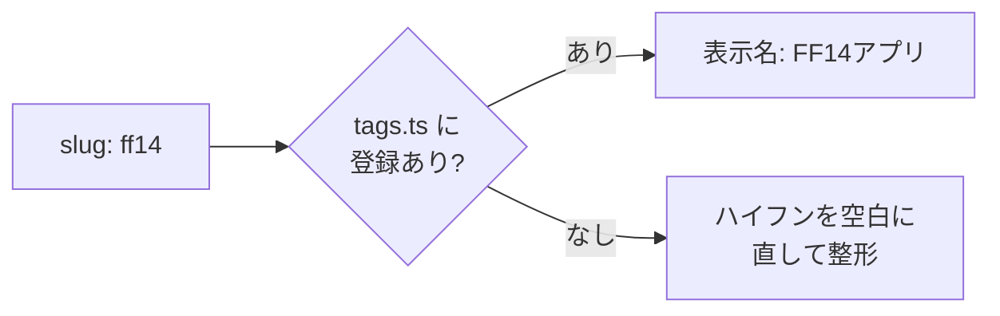
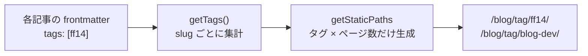

記事がそこそこ溜まってきて、「ブログ自体の開発の話」と「FF14アプリ開発の話」の2系統に分かれてきました。読む側からすると、興味のある方だけ辿れた方がいいはずです。そこで記事にタグを付けて、タグごとに絞り込めるようにしました。

将来は `TypeScript` や `MySQL` みたいな技術スタック単位でも引けるようにしたいので、その拡張がしやすい形を意識しています。

## どう絞り込めるようにするか

やりたいことは、前に作った[年で絞り込む機能](/blog/year-filter)とほぼ同じです。「ある条件に一致する記事の一覧ページを、ビルド時に静的生成する」だけ。年を slug に置き換えれば、そのまま流用できます。

設計で迷ったのは、タグを **フラットな1種類にするか、2軸（連載シリーズ＋技術タグ）に分けるか** でした。結論はフラットな単一タグです。最初は「FF14アプリ」「ブログ開発」の2つだけ、あとから技術タグを同じ仕組みに足していけばいい。仕組みを2系統持つより、まず1本で通す方が学習の見通しも良いと考えました。

## スキーマにタグを足す

記事のフロントマターを検証している `src/content.config.ts` に `tags` を追加します。

```ts
const blog = defineCollection({
  loader: glob({ pattern: "**/*.md", base: "./src/content/blog" }),
  schema: z.object({
    title: z.string(),
    description: z.string(),
    pubDate: z.date(),
    author: z.string().optional(),
    tags: z.array(z.string()).default([]),
  }),
});
```

`default([])` にしておくと、タグ未指定の記事でも常に配列として扱えます。あとは各記事に `tags: ["ff14"]` のように書くだけです。

## slug と表示名を分ける

ここが今回の肝です。フロントマターに書くのは `ff14` や `blog-dev` のような **英小文字の slug** にして、画面に出す表示名（`FF14アプリ` など）は別で管理することにしました。

理由は URL です。タグページは `/blog/tag/ff14/` のような形になりますが、ここに `FF14アプリ` のような日本語を入れると URL がエンコードされて扱いづらくなります。slug を英字に固定しておけば、URL はきれいなまま、表示名は日本語で自由に付けられます。

表示名は `src/data/tags.ts` にレジストリとして置きました。これは既に著者管理で使っている `src/data/authors.ts` と同じ考え方で、**未登録の slug は自動でフォールバックする**ようにしてあります。

```ts
export const tags = {
  ff14: { label: "FF14アプリ" },
  "blog-dev": { label: "ブログ開発" },
  // 技術タグは表示名だけ先に用意しておく
  typescript: { label: "TypeScript" },
  mysql: { label: "MySQL" },
  // ...
} satisfies Record<string, Tag>;

/** slug から表示名を得る。未登録なら slug を整形してフォールバック */
export function getTagLabel(slug: string): string {
  if (slug in tags) return tags[slug as TagSlug].label;
  return slug.replace(/-/g, " ").replace(/\b\w/g, (c) => c.toUpperCase());
}
```

この形にしておくと、技術タグは表示名だけ先に定義しておけて、あとは記事に slug を足すだけで有効になります。仮にレジストリへの登録を忘れても、`some-tag` が `Some Tag` として表示されるだけで壊れません。

slug から表示名を引く流れはこうです。



## タグの集計

サイドバーに「FF14アプリ (3)」のように件数付きで出したいので、全記事からタグを集計するヘルパーを `src/utils/blog.ts` に足します。年の集計とほぼ同じ形です。

```ts
export function getTags(posts: Post[]): TagCount[] {
  const map = new Map<string, number>();
  for (const post of posts) {
    for (const slug of post.data.tags) {
      map.set(slug, (map.get(slug) ?? 0) + 1);
    }
  }
  return [...map.entries()]
    .map(([slug, count]) => ({ slug, label: getTagLabel(slug), count }))
    .sort((a, b) => b.count - a.count || a.slug.localeCompare(b.slug));
}

/** 指定タグを含む記事だけを返す */
export function getPostsByTag(posts: Post[], slug: string): Post[] {
  return posts.filter((post) => post.data.tags.includes(slug));
}
```

## タグページを静的生成

`src/pages/blog/tag/[tag]/[...page].astro` で、タグごとにページングした一覧を生成します。`getStaticPaths` で「タグの数 × ページ数」だけパスを吐く、という年フィルタと同じ作りです。

```ts
export const getStaticPaths = (async ({ paginate }) => {
  const posts = await getSortedPosts();
  return getTags(posts).flatMap(({ slug }) => {
    const tagPosts = getPostsByTag(posts, slug);
    return paginate(tagPosts, { params: { tag: slug }, pageSize: PAGE_SIZE });
  });
}) satisfies GetStaticPaths;
```

ビルド時の流れを図にするとこうなります。



これで各タグが独立した URL を持つので、完全静的のまま SEO にも有利です。

## 一覧と記事にタグを出す

最後に画面へ出します。置いた場所は3つです。

| 場所 | 見せ方 |
| :--- | :--- |
| サイドバー | 「タグで絞り込み」として件数付きリンク（年フィルタの下に並べる） |
| 記事カード | タグのチップを表示 |
| 記事ページ | クリックでタグページへ飛ぶチップ |

ここで1つ引っかかりました。記事カードは**カード全体が1つの `<a>`** で囲われています。その中にタグへのリンク（`<a>`）を入れると `<a>` の入れ子になり、HTML として不正です。

なので、カード上のタグは**リンクではない見せるだけのチップ**にして、実際に飛べるリンクは「記事ページのヘッダー」と「サイドバー」に置きました。カードはクリックすれば記事本文へ、タグで回遊したいときはサイドバーか記事ページから、という住み分けです。

## まとめ

- タグは**フラットな単一の `tags`** にして、まずは連載単位（FF14アプリ / ブログ開発）で運用
- frontmatter には**英小文字の slug**、表示名は `tags.ts` のレジストリで管理し、未登録でも壊れないフォールバック付き
- タグページは年フィルタと同じ `getStaticPaths` で静的生成
- カードのタグは `<a>` の入れ子を避けて非リンクのチップに

仕組みとしては技術タグもすぐ足せる状態になったので、次は記事に `TypeScript` や `Astro` のようなタグを付けて、スタック単位でも辿れるようにしていくつもりです。
